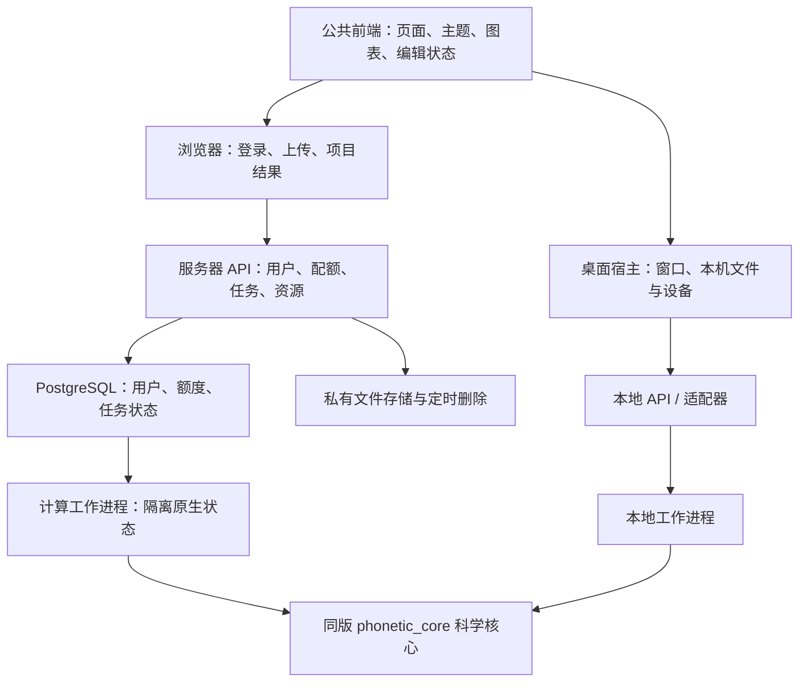

# PhoneticToolbox v3 架构设计

**D0.3 / 2026-09-09 / 待审阅的实施依据。** 已确认的是产品方向、功能保留、来源署名、登录隔离、5 GB 与 7 天；具体技术候选须按 P01 原型验证后冻结。

**P01 实施更新：** 已授权最小原型。Windows 探针使用独立 CPython + PyQt6/Qt WebEngine，资源通过只读自定义 scheme 装载；这是 P01 的单页验证适配，不替代下文 P02/P06 的本地 API 与会话鉴权架构。当前实测结果与冻结边界见 ADR-012 和 P01 报告。

## 1. 目标与不可破坏的约束
- 一套共用 Web 界面：U2 紧凑工作台、全部页面浅/深主题、统一侧栏和标签页。
- 一个科学核心包，桌面本机与服务器分别安装同版本，独立运行；基础桌面分析不依赖网络登录。
- 保留 v2 15 模块、83 功能组、80 参数键、14 参数估计设置及现有格式。用户界面可优化，科学语义不能静默改变。
- 网页面向约 10 位并发研究者，独立登录；各人文件/任务/结果严格隔离，最多 5 GB，数据最多 7 天。
- 不依赖旧方言站点、旧 FastAPI 工程或开发机 v2 路径。允许经核对后迁移 v2 可用代码和资源。
- 所有第三方算法、实现、模型和素材有可追溯说明；学术方法与工程集成分别署名。

## 2. 总体结构

这里的 CORE 表示同源同版本的软件包，不是桌面和服务器共用一个远程实例。

## 3. 技术选择及替代方案
| 层 | 候选方案 | 理由 | 冻结条件 |
| --- | --- | --- | --- |
| 前端 | Vue 3 + TypeScript + Vite | 独立工程、组件复用、类型契约；不拷贝旧站构建 | 多轨音频、IPA 字体、选区精度、深浅主题验证 |
| 桌面宿主 | PyQt6 + Qt WebEngine | 延续 Python/Qt 经验，容纳共用 UI，保留原生音频能力 | 单文件打包、启动/退出、音频设备、许可审查通过 |
| HTTP | FastAPI + Pydantic | 接口模型可生成 OpenAPI，Python 核心复用 | 本地/服务器同契约测试 |
| 核心 | Python 3.11 起步、NumPy/SciPy/Parselmouth 等锁定版本 | 先对齐现有 phonetic_311 数值行为 | 可安装 wheel，不依赖 Qt/HTTP/旧路径 |
| 服务器状态 | PostgreSQL | 原子配额、多用户任务、重启后状态；开发与部署同数据库 | WSL 集成测试、额度竞态、迁移审阅 |
| 任务调度 | PostgreSQL 任务表 + 独立 worker | 初期无需再运维一个消息中间件；适合有限规模 | 租约、幂等、取消、崩溃恢复测试 |
| 文件存储 | 本地私有目录 + StorageAdapter | WSL/首台服务器部署简单 | 容量保护、删除/到期/下载鉴权验证 |
| 大规模扩展 | Celery/专用队列、对象存储 | 作为后续替换接口，当前不先拆微服务 | 实测负载证明有需要再立 ADR |

FastAPI BackgroundTasks 不作为可靠长计算队列；PostgreSQL SKIP LOCKED 可以用于消费者任务表，但租约、重试和结果幂等仍由应用设计。[FastAPI](https://fastapi.tiangolo.com/tutorial/background-tasks/)、[PostgreSQL](https://www.postgresql.org/docs/current/sql-select.html)

Tauri/Electron 和 PySide6 属于宿主比较项，不在未验证前来回切换。不能把 PyQt 的许可等同于 Qt 的许可。[Riverbank](https://www.riverbankcomputing.com/software/pyqt/intro)

## 4. 目录与允许依赖
```text
frontend/                     UI 和平台能力客户端
backend/src/ptb_api/           API、鉴权、配额、服务端存储
backend/src/ptb_worker/        作业认领、租约、执行与回收
desktop/src/ptb_desktop/       Qt 宿主、本地启动、设备与目录
packages/phonetic_core/        algorithms / models / services / ports
contracts/                    OpenAPI、数据字典、兼容策略
resources/                    字典、图标、字体、原生组件清单
third_party/                  来源登记、参考文献、许可文本
tests/                        parity / contracts / security / packaging / e2e
docs/                         要求、计划、ADR、设计、验证与发行
phonetic_toolbox/              原样继承的 v2 迁移来源，逐步退役
```
目标源码子目录将在各任务实现时建立，本轮先建立相应规则与架构文件。

依赖只能由外向内：frontend → contracts；backend/desktop → contracts + phonetic_core；phonetic_core 只能依赖标准库、数学/音频库与定义明确的 ports。core 不可反向导入业务外层。服务端和桌面不互相 import。部署/打包逻辑不进算法模块。

科学服务允许编排数组、分段、参数和结果；文件持久化、网络、认证、数据库和设备由外层适配。原 v2 里耦合的文件服务先拆 I/O，再移入科学编排层。不能仅把 GUI 类换个目录就声称完成分层。

## 5. 一套界面的平台能力协议
| 能力 | 桌面 | 网页 |
| --- | --- | --- |
| FileProvider | 系统选择框；选择结果映射为资源句柄 | 上传或选择自己的项目资源 ID |
| JobClient | 本地任务状态；退出时协调取消 | 持久服务端任务；关页后可重新登录查看 |
| AudioController | 常规试听与原生实时音频适配 | 浏览器音频，实验刺激预加载 |
| CaptureProvider | 本机相机/麦克风与原生模式 | HTTPS 与浏览器授权采集 |
| ProjectStore | 本机文件夹与配置；不应用网页 7 天清理 | 账号归属、5 GB 和文件过期策略 |
| CitationProvider | 离线内置来源文本；可选打开官方链接 | 同一版本来源登记与外链 |

页面只依赖这些协议，不能 scattered if desktop 分叉出另一套 UI。Web 不接收任意 D:\\ 路径；浏览器文件夹上传不等于服务器能访问本机目录。

## 6. 本地启动、网络与退出
桌面只装载打包的静态前端，不启动 Vite 开发服务器，不运行 npm，不要求用户安装 Python/Node。
宿主启动只监听 127.0.0.1 的随机端口服务，建立本次会话随机凭据、精确 Origin/Host 校验和健康握手；前端与 API 尽量同源。随机端口不等于鉴权。
新窗口使用统一路由；IPA、感知实验、标注、声道不再自行开外部浏览器。
退出顺序：询问未保存编辑 → 停止新增任务 → 请求本地任务取消 → 关闭相机/声卡 → 停止子进程和服务。只能停止记录的本应用子进程，不能按通用进程名或端口批量杀进程。
页面外链默认交系统浏览器；第三方手册不进入拥有本地文件权限的宿主页。
MFA、REAPER、VTL 等进程通过平台适配器启动，参数列表调用、有限超时、取消与错误分类；无全局 PATH 改写。

## 7. 数据与科学契约
- 音频字段以 contracts 为准：sample_rate_hz、channel_roles、sample_count、origin；sample_count 指每声道采样帧数，内部选区使用整数采样点与半开区间 [start,end)。
- 时间轨迹携带真实时间数组，不用序号冒充时间；输出时间换算只在边界进行。
- 80 参数键为协议标识，不以中文标签代替。pF0/rF0 等算法来源分别可选。
- NaN/无声/算法失败不合并：JSON 用 null + validity/reason，禁止非法 NaN；图上留缺口，不补 0 或自动跨无声区平滑。
- 每任务记录 config_snapshot、core_version、adapter_version、算法后端、source_ids、输入内容校验和、随机种子（如适用）。
- 显示降采样与计算/导出分开，图表缩放不得改变科研数据。
- 采样率改变、WAV 量化、TextGrid 起点、毫秒/秒/采样点和缺失值属于回归重点。
- PKL 为历史兼容格式，服务器不能直接反序列化任意用户 pickle；设计受限兼容读取或安全交换格式，迁移在单独任务审阅。
- F0 跟踪回退必须记录实际后端；界面不再把 IRAPT 失败回退后的结果仍标成 IRAPT。

## 8. 任务、账号与文件生命周期
详细规范见 [账号与存储](docs/specs/accounts-storage-jobs.md)。
所有资源必须属于 owner；下载、缩略图、波形、SSE、导出归档和取消同样检查权限。
目标为 10 人并发交互；初始建议全局 2 个重计算 worker、每人 1 个运行任务，按 P11 压测结果调整，不承诺十个重型任务同时计算。
任务状态：queued → running → succeeded / failed / cancelled，并定义 cancel_requested 与 interrupted 的恢复规则。文件的 expired/deleting/delete_failed 是独立资源状态，不混入任务枚举。成功必须在产物写入、额度结算和结果清单提交之后。
按账号原子预留空间再写文件，实际占用 + 预留不超过 5,000,000,000；删除成功后释放实际额度。临时文件、解压展开和导出 ZIP 都不能绕过配额。
上传最多 7 天；结果从本次生成成功时起最多 7 天；访问/下载不续期。账户信息与最少任务审计元数据可保留，原始语料及结果不长期存档。
到期不可被活动任务无限延长；任务创建前校验输入剩余有效期。到期自动取消相关未完成引用，不能用重试偷偷续期。
调度器提前至截止前执行删除；到期 API 无条件拒绝访问。宕机恢复先清理再开放文件访问；记录物理删除延迟与失败，不能只从数据库隐藏文件。
用户可以删除而不下载；不强制“一定先下载”。下载也不等于主动删除。

## 9. 原生能力与平台边界
VTL 当前 Windows DLL 不能搬到 Linux/macOS 使用；需保留可重建来源、ABI、架构与原生测试。一个 VTL 实例的状态不应被两个账号共享；采用进程隔离/受控实例池。
MFA 与模型按平台单独验证；不是随便复制 Windows 环境即可跨平台。
声道持续发声、摄像头高帧率、麦克风同步、感知实验时序均单独测量。Web 网络往返不参与刺激呈现计时，音频先下载预加载后由客户端计时。
macOS 当前无实机，构建检查和实际设备通过分开记录；WSL 仅提供 Linux 服务环境证据。

## 10. 设计、说明书与来源
设计规范只定义 UI，不为不存在的算法结果配假截图。全部页面有 empty/loading/running/error/cancelled/quota/expired 等适用状态。
来源登记是一份结构化数据；软件关于页、各模块方法说明、说明书引用、BibTeX 和随包第三方清单从同一来源生成并交叉验证。
文献存在、代码对应、许可证明确、数值等价是四种独立状态。找到了论文不代表完成代码来源审计，也不代表算法等价已验证。

## 11. 失败模式与验证
| 失败 | 行为与检查 |
| --- | --- |
| worker 崩溃 | 租约到期标 interrupted；释放/核对预留；不会出现伪成功结果 |
| 磁盘不足 | 停止写入并返回可理解错误；不损坏既有产物；触发全局磁盘保护 |
| 删除失败 | 仍计占用、不可访问，保留重试记录；不提前释放额度 |
| 数据库不可用 | 暂停提交与新写入；不会只在内存接受丢失的任务 |
| 刷新/断网 | 后台作业状态可恢复；编辑草稿规则明确；不得重复提交同一幂等请求 |
| VTL/REAPER 不可用 | capability 报告真实缺失，不显示假可用按钮/曲线 |
| 跨用户请求 | 资源枚举/下载/日志/取消均拒绝，响应不泄露他人文件名 |
| 主题/缩放切换 | 不丢编辑、选区和任务状态 |

## 12. 更改控制与冻结
P01 验证完冻结宿主和图表候选，P02 冻结包边界与接口版本，P03 冻结科学基线。此后改动上述决定需 ADR。
新增平台、改变默认算法、删除功能、改持久化模型、改身份体系、突破容量保留规则，都不是随手修 UI 的附带修改。
每个任务有可定位文件、回归样例、文档责任和退出条件。整个工作区遵守 AGENTS.md。
