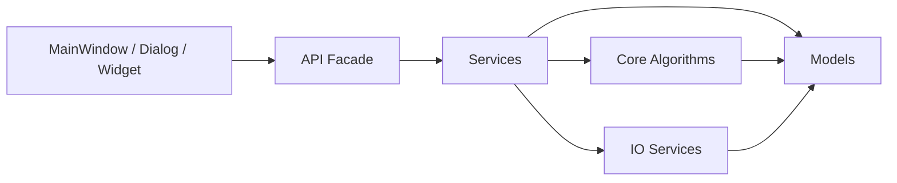

# PhoneticToolbox v2

[](#环境要求)
[](#环境要求)
[](#项目亮点)
[](#许可证)

PhoneticToolbox v2 是一个面向语音学研究、教学与实验流程的一体化分析工具箱，覆盖声学参数估计、EGG 分析、语音合成、语谱图逆重建、唇形提取与多类实验入口。项目基于 Python + PyQt6，采用严格分层架构，支持开发态与打包分发。

> 📘 使用说明书（推荐先读）：[在线渲染版](https://htmlpreview.github.io/?https://raw.githubusercontent.com/Nephelium/PhoneticToolbox/main/Phonetic_Export/index.html) ｜ [仓库文件](Phonetic_Export/index.html)  

## 功能概览

- 声学参数估计：F0（Praat / REAPER）、共振峰、H1-H4 / A1-A3 / H2K / H5K、Jitter / Shimmer、CPP、HNR、SHR、SoE、参数校正
- EGG 分析：GCI/GOI 事件检测、CQ/SQ 计算、逆滤波（CP-IF）
- 语音合成实验室：Klatt 参数化合成、参数曲线编辑、回读分析
- 语谱图转音频：基于 Griffin-Lim 的逆重建（支持截图/图像导入）
- 唇形提取：摄像头采集、视频上传逐帧识别、与音频对齐导出
- 变调实验室：交互式 F0 编辑、批量变调刺激生成
- LPC 谱图：选区联动、TextGrid 标签联动、高 DPI 导出
- 工具入口：普通话转 IPA、感知实验、MFA 自动标注入口

## 项目亮点

- 分层清晰：GUI / Services / Core / Models 边界明确
- 算法完整：集成 Praat、REAPER、LPC、Griffin-Lim、Klatt 等核心链路
- 工程可维护：配置模型化、服务层编排、核心算法模块化
- 可打包分发：支持 PyInstaller onefile

## 模块流程图



## 界面截图占位

- 主页  
  
- 参数估计  
  
- EGG 分析  
  
- 语音合成实验室  
  
- 唇形提取  
  

## 架构设计

本项目遵循严格的分层约束：

- Outer Layer（GUI） → Middle Layer（Services/API） → Inner Layer（Core/Models）
- Core 层禁止依赖 GUI/Services
- GUI 层只做交互与展示，不放核心算法

### 目录结构

```text
PhoneticToolbox_v2/
├── docs/                       # 项目文档
├── phonetic_toolbox/           # 源代码根目录
│   ├── api/                    # [Middle Layer] 对外暴露的简洁 API (Facade)
│   │   └── __init__.py         # 导出 launch_lip_extraction / launch_ipa_trans / launch_perception_experiment 等入口
│   ├── core/                   # [Inner Layer] 纯粹的领域逻辑与算法
│   │   ├── acoustic/           # 声学参数提取
│   │   │   ├── README.md           # 声学模块说明文档
│   │   │   ├── __init__.py
│   │   │   ├── common.py           # 通用声学计算工具 (分帧、频率转换等)
│   │   │   ├── corrections.py      # 能量校正算法 (Iseli & Alwan)
│   │   │   ├── cpp.py              # 倒谱峰值突出度 (CPP) 计算
│   │   │   ├── energy.py           # 能量/强度计算 (Intensity dB)
│   │   │   ├── f0_praat.py         # Praat 算法基频提取
│   │   │   ├── f0_reaper.py        # REAPER 算法基频提取 (Wrapper)
│   │   │   ├── formants_praat.py   # Praat 算法共振峰提取 (含自动限额移位)
│   │   │   ├── hnr.py              # 谐波噪声比 (HNR) 计算 (多频带)
│   │   │   ├── jitter_shimmer.py   # 抖动与闪烁计算 (Local, RAP, PPQ5, APQ3/5/11)
│   │   │   ├── reaper_python.py    # REAPER 算法的原生 Python 实现
│   │   │   ├── shr.py              # 次谐波-谐波比 (SHR) 计算 (归一化)
│   │   │   ├── soe.py              # 激励强度 (SoE) 计算 (ZFF方法)
│   │   │   ├── spectral_batch.py   # 批量频谱参数计算 (H1-H4, A1-A3, H2K, H5K)
│   │   │   ├── spectral_slope.py   # 频谱倾斜计算
│   │   │   ├── lpc.py              # LPC 频谱计算核心算法
│   │   │   └── voicing.py          # 清浊音与静音检测 (基于ZCR和能量)
│   │   ├── alignment/          # 强制对齐 (MFA/Montreal Forced Aligner)
│   │   │   └── __init__.py
│   │   ├── articulatory/       # 发音运动数据处理 (EMA 等)
│   │   │   └── __init__.py
│   │   ├── egg/                # EGG (电声门图) 信号处理
        │   ├── __init__.py
        │   ├── analysis.py         # EGG 核心分析算法 (CQ, SQ, DECPA)
        │   └── inverse_filtering.py # 逆滤波算法 (CP-IF)
        ├── manipulation/       # 音频修改与合成
        │   ├── README.md
        │   ├── __init__.py
        │   ├── synthesis.py        # PSOLA 合成算法 (Praat/Parselmouth)
        │   └── batch_utils.py      # 批量变调与合成逻辑
        ├── perception/         # 感知实验数据处理（预留核心算法目录）
        │   └── __init__.py
        ├── signals/            # 基础数字信号处理 (DSP)
        │   ├── __init__.py
        │   └── filters.py          # 滤波器设计与应用 (低通/高通/带通)
        ├── spec2wav/           # 语谱图转音频 (Griffin-Lim)
        │   ├── __init__.py
        │   ├── common.py           # 通用工具 (重采样, dB转换)
        │   ├── griffin_lim.py      # Griffin-Lim 算法实现
        │   └── image_processing.py # 图像处理与加载
        ├── synthesis/          # 语音合成
        │   ├── __init__.py
        │   └── klatt/              # Klatt 参数化语音合成核心（纯算法/参数）
        │       ├── __init__.py
        │       ├── input_parser.py     # 元音序列解析与分段
        │       ├── klatt_config.py     # 默认参数与范围定义
        │       ├── smoothing_utils.py  # 平滑与过渡工具
        │       ├── spectral_filter.py  # 谱包络滤波组件
        │       └── tdklatt.py          # 时域 Klatt 合成核心
        └── transcription/      # 自动/手动标注处理
│   │       └── __init__.py
│   ├── gui/                    # [Outer Layer] 用户界面 (PyQt6)
│   │   ├── dialogs/            # 模态/非模态对话框
        │   ├── manipulation_dialogs.py # 变调相关对话框 (批量处理, 拐点编辑, 导入F0)
        │   ├── egg_batch_dialog.py # EGG 批量处理对话框
        │   └── settings_dialog.py  # 全局设置弹窗
        ├── resources/          # 静态资源 (图标, 图片, 前端页面资源)
        │   ├── ipa_trans/          # 普通话转 IPA 前端页面生成与产物
        │   │   ├── generate_ipa_website.py
        │   │   └── ipa_converter.html
        │   └── __init__.py
        ├── viewmodels/         # MVVM 模式的 ViewModel (可选)
        │   └── __init__.py
        ├── views/              # 复杂的视图布局
        │   └── __init__.py
        ├── widgets/            # 可复用 UI 组件
        │   ├── __init__.py
        │   ├── acoustic_widget.py          # 声学参数可视化组件
        │   ├── parameter_estimation_widget.py # 参数估计与批处理主组件
        │   ├── pitch_manipulation_widget.py # 变速变调 (基频实验室) 主组件
        │   ├── speech_synthesis_widget.py   # 语音合成实验室主组件（Klatt 参数编辑与联动视图）
│   │   │   ├── egg_widget.py       # EGG 分析主组件
│   │   │   ├── spec2wav_widget.py  # 语谱图转音频主组件
│   │   │   └── lpc_spectrum_widget.py # LPC 谱图主组件（波形选区 + TextGrid 联动）
        ├── workers/            # 后台工作线程
        │   ├── manipulation_workers.py # 批量变调处理线程
        │   └── egg_workers.py      # EGG 分析与加载线程
        ├── __init__.py
        ├── main_window.py      # 应用程序主窗口
        ├── styles.py           # QSS 样式表定义 (支持日间/夜间模式)
        └── utils.py            # GUI 专用工具 (主题应用, 音频播放)
│   ├── models/                 # [Inner Layer] 数据结构定义 (Pydantic/Dataclasses)
    │   ├── __init__.py         # 存放跨层共享的数据模型 (如 Config, AnalysisResult, LaunchResult)
    │   ├── config.py           # 配置模型定义
    │   ├── egg_models.py       # EGG 分析结果模型定义
    │   ├── ipa_models.py       # 普通话转 IPA 启动结果模型
    │   ├── lip_models.py       # 唇形提取启动结果模型
    │   ├── lpc_models.py       # LPC 配置与结果模型定义
    │   ├── perception_models.py # 感知实验启动结果模型
    │   └── spec2wav_models.py  # 语谱图转音频模型定义
    ├── services/               # [Middle Layer] 应用业务逻辑与 IO
│   │   ├── io/                 # 文件输入输出
│   │   │   ├── __init__.py
│   │   │   ├── excel.py            # Excel/CSV 导入导出
│   │   │   ├── lip.py              # 唇形数据文件 (.pkl) 读写
│   │   │   ├── textgrid.py         # TextGrid 标注文件解析与生成
│   │   │   └── wav.py              # 音频文件读写
│   │   ├── pipelines/          # 复杂处理流程
│   │   │   └── __init__.py
│   │   ├── __init__.py
        ├── acoustic_service.py # 声学参数分析服务 (串联 Core 算法与 IO)
        ├── egg_service.py      # EGG 分析服务 (GCI/GOI 检测, CQ/SQ 计算, 逆滤波)
        ├── ipa_trans_service.py # 普通话转 IPA 服务（按需生成并打开前端页面）
        ├── lip_service.py      # 唇形提取服务（定位并打开外部项目入口）
        ├── lpc_service.py      # LPC 谱图服务（音频读取、TextGrid 解析、导出保存）
        ├── manipulation_service.py # 变速变调服务 (音频加载, 合成, 批处理)
        ├── perception_service.py # 感知实验服务（定位并打开外部 HTML）
        ├── settings_service.py # 配置管理服务 (单例模式, 持有运行时配置对象)
        └── spec2wav_service.py # 语谱图转音频服务
    ├── tests/                  # 单元测试与集成测试
│   │   └── core/
│   │       └── test_acoustic.py    # 声学算法测试用例
│   │   ├── test_lip_service.py      # 唇形提取服务测试
│   │   ├── test_lpc_service.py      # LPC 服务测试
│   │   └── test_perception_service.py # 感知实验服务测试
│   ├── utils/                  # 通用工具库
│   │   └── __init__.py         # 日志, 装饰器, 辅助函数
│   ├── __init__.py
│   └── app.py                  # PyQt Application 初始化配置
├── ARCHITECTURE.md             # 架构规范文档
├── README.md                   # 项目说明文档
├── main.py                     # 程序打包入口
├── pyproject.toml              # 项目依赖与构建配置
├── requirements.txt            # Python 依赖列表
├── run.py                      # 开发环境启动脚本
```

## 快速开始

### 环境要求

- Python 3.9+
- 推荐 Windows（桌面端与打包流程验证最完整）

### 安装

```bash
git clone <your-repo-url>
cd PhoneticToolbox_v2
pip install -r requirements.txt
```

### 运行

```bash
python run.py
```

## 子模块文档

- 声学核心：[phonetic_toolbox/core/acoustic/README.md](phonetic_toolbox/core/acoustic/README.md)
- EGG 核心：[phonetic_toolbox/core/egg/README.md](phonetic_toolbox/core/egg/README.md)
- 语谱图转音频：[phonetic_toolbox/core/spec2wav/README.md](phonetic_toolbox/core/spec2wav/README.md)
- 变调核心：[phonetic_toolbox/core/manipulation/README.md](phonetic_toolbox/core/manipulation/README.md)
- Klatt 合成核心：[phonetic_toolbox/core/synthesis/klatt/README.md](phonetic_toolbox/core/synthesis/klatt/README.md)
- 服务层说明：[phonetic_toolbox/services/README.md](phonetic_toolbox/services/README.md)
- 数据模型说明：[phonetic_toolbox/models/README.md](phonetic_toolbox/models/README.md)
- GUI 层说明：[phonetic_toolbox/gui/README.md](phonetic_toolbox/gui/README.md)

## 许可证

MIT License
