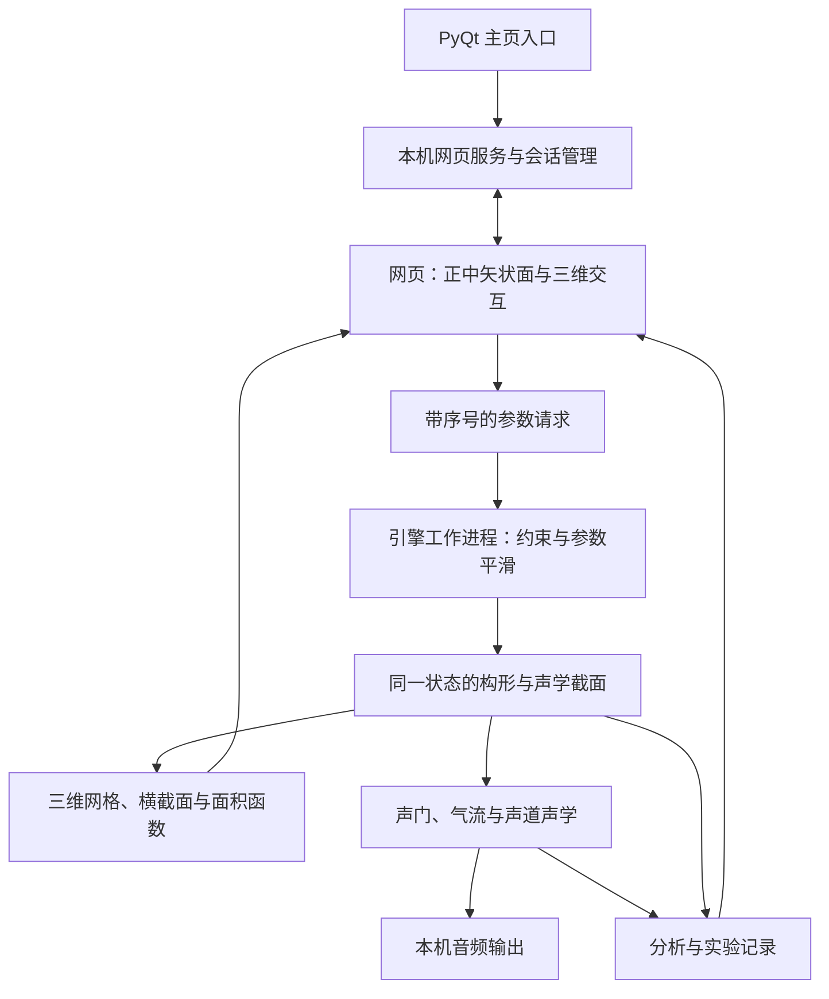

# 头部与声道交互建模规划

**日期：** 2026-09-07  
**状态：** 井井已授权先试 P0。2026-09-07 已完成独立原型的真实几何、合成与网页交互闭环，性能和科研验证仍有未完成项，见 [P0 验证结果](../../prototypes/vocal_tract_lab/P0-验证结果.md)。开发测试按井井最新授权独立放在 `prototypes/vocal_tract_lab/`，集成 EXE 时再落实主项目架构约束。  
**2026-09-08 更新：** 按井井反馈修复音频设备路由，补上二维/三维唇部拖动、原生中线截面和真实平均鼻腔参考；通过网格三个开口纠正鼻腔前后方向并添加回归检查。14 项自动检查通过，内置 Realtek 扬声器短时实际输出无欠载。鼻腔参考尚未与 JD2 声学管道重新配准，完整组织建模与科研校准仍待完成，见 [优化验证](../../prototypes/vocal_tract_lab/2026-09-08-优化验证.md)。  
**Goal：** 建立一个以正中矢状面为主要操作视图、能控制发音器官并听到声学结果的通用头部模型，逐步支持可重复的语音学实验。  
**Architecture：** 网页负责交互和三维显示，本机引擎负责构形与声学计算；以同一模型状态驱动图形、声道截面、声音和导出。先验证 VocalTractLab 是否满足接口、几何一致性及实时要求，再确定需要自行扩展的部分。  
**Tech Stack：** Python / PyQt6、Three.js / WebGL、VocalTractLab C/C++ API 候选、现有 sounddevice / NumPy / SciPy；MRI 与网格预处理按需使用 3D Slicer、Blender。浏览器内的 WebAssembly / AudioWorklet 合成列为后续路线。

## 1. 要实现的使用体验

从工具箱主页点击“头部与声道建模”，自动打开本机网页。默认显示头部正中矢状面，能够看到唇、牙齿、舌、硬腭、软腭、小舌、咽腔和喉入口；可切换半透明三维视图、旋转头部，随后一键回到正中矢状面。

开启发声后，拖动发音器官或调节参数，声音随构形变化。选中声道任意位置，旁边显示该处横截面；面积函数与传递函数同步更新。可以保存当前构形，录制参数运动，重放并导出音频和完整实验参数。

界面以解剖位置和语音学参数为主。主视图区放大正中矢状面；左侧选择器官和预设，右侧编辑参数，下方联动显示面积函数、传递函数与输出频谱。声门开合的小视图单独呈现，明确显示其为模型结果或示意动画。

## 2. 范围与版本边界

### 2.1 首个可用版本

| 能力 | 首版交付标准 |
|---|---|
| 头部 | 通用成人头部，外部轮廓简化；标明模型来源，不称为任何指定个人的数字孪生 |
| 视图 | 真正的三维模型、固定正中矢状面、半透明/显示隐藏、当前横截面 |
| 唇与下颌 | 开口、圆唇/前突、下颌开合；受模型有效范围约束 |
| 舌 | 舌尖、舌背、舌根及必要的舌侧参数；显示接触、狭窄和侧向通路 |
| 软腭与鼻腔 | 控制软腭和腭咽口，声学引擎实际接入口鼻分支；实现口元音与鼻化的连续变化 |
| 咽部与喉位 | 明确哪些控制直接改变咽壁，哪些通过舌根/喉位改变咽腔；缺失的独立控制在引擎中扩展后才开放 |
| 小舌 | 可见、随软腭运动；独立弯曲与自振动放入研究扩展，不以装饰动画冒充独立声学控制 |
| 发声 | 持续元音、元音间连续过渡、F0 与强度控制；声源参数按实际声门模型提供 |
| 记录 | 保存构形、记录和回放动作、导出 WAV、参数轨迹、面积函数及实验清单 |
| 启动与退出 | 主程序一键启动；关闭或失去控制会话后停止发声；主程序退出时清理本功能拥有的资源 |

首版先覆盖上述通用模型与元音操作。普通话预设需单独校准；德语/英语数据中的构形不能直接标成普通话标准构形。

### 2.2 后续研究扩展

1. 擦音、塞音、边音和协同发音：加入或校验湍流噪声、闭塞压力、释放事件及侧腔通路。
2. 小舌独立形变与颤音：先建立静态几何影响，再研究组织与气流的动态耦合。
3. 声带自振动、声源与声道反馈耦合、不同发声类型。
4. 个体化解剖：导入指定被试的三维数据和动态约束，重新拟合；不从普通照片推断内部声道。
5. 对选定构形做三维声学离线计算；按问题需要考虑更复杂的流体或组织力学。
6. 将已验证的引擎移植为 WebAssembly，实现完全在浏览器内运行。

## 3. 已验证基础与需要验证的假设

### 3.1 本项目现状

- `phonetic_toolbox/gui/main_window.py` 已有 `on_web_praat_editor()`，支持由桌面按钮打开本机网页。
- `phonetic_toolbox/services/web_praat_server.py` 已有回环地址、随机端口、静态资源定位和服务关闭流程；可参考其模式，新功能使用独立服务与状态。
- `phonetic_toolbox/core/synthesis/klatt/tdklatt.py` 是现有参数化合成核心，可作声学对照；它不直接提供本规划所需的三维器官构形系统。
- `phonetic_toolbox/core/acoustic/` 可复用部分音频回读分析；主声学验证仍应比较传递函数，不能只依赖 Praat 从成品音频估计的共振峰。
- `pyproject.toml` 当前声明 MIT，已包含 sounddevice、NumPy、SciPy；打包遵守 `AGENTS.md` 中的 `phonetic_311` 规则。
- 当前工作区已有多项用户改动。实施前记录基线，只提交本功能所需文件；不能把旧文档中的发音模拟器条目当成现有可运行功能的证据。

### 3.2 不能提前承诺的事项

- VTL 官方 2.4 发布包的实际 API、参数、模型文件与开发分支可能不同，必须固定版本并探测。
- 三维网格导出能否满足连续交互、哪些器官单独可取、拓扑能否保持稳定，需要实测。
- 引擎内部的声学截面修正未必完整反映到可视网格，不能承诺现成模型已经做到逐处一致。
- 任意自定义 STL 不能直接当作 VTL 的可动 speaker 模型；需要拟合、参数化或另外的几何适配器。
- 实时性能与输入到声音的延迟未经本机验证；本文数字是验收目标，不是已有结果。

## 4. 数据计划

| 来源 | 核实到的内容和许可 | 计划用途 | 获取顺序 |
|---|---|---|---|
| Dresden Vocal Tract Dataset [S1–S2] | 2人各22个德语音，MRI、STL、有限元模型与声学数据；CC0；压缩包约1.13 GB | 静态网格、牙齿与声道细节参考，声学验证基准 | 首批，先使用同一说话人的 /a i u/ 相应构形 |
| 带人工器官标注的动态 MRI [S3] | 5人392帧，二维10 fps，分割和腭咽闭合标签；CC BY 4.0；约22 MB | 轮廓、器官命名、软腭闭合及运动参考 | 首批 |
| VTL 2.4 与模型文件 [S6–S8] | 官方发布软件、声道/声门参数模型及 API；源码 GPL，模型文件另核对随附声明 | 参数化与声学引擎候选，最小发声原型 | 首批 |
| USC 75人 Speech MRI [S4–S5] | 动态二维影像及同步音频、静态三维与静息影像；CC BY 4.0；视频包约2.55 GB、三维包约92.6 GB | 扩展动态参考、个体差异和后续拟合 | 基本方案成立后按需获取 |

处理规则：

1. 下载前核对来源、文件体积与发布许可；保存版本、下载日期、上游校验值和本地 SHA-256。只获取公开数据，不注册、签署协议或联系作者。
2. 原始数据与处理结果分目录保存。原始文件只读；坐标变换、分割修订和网格简化均记录脚本版本与参数。
3. 首个解剖模型尽量采用同一说话人的数据。其他来源只作验证参考；如混用鼻腔或头壳，明确标为通用混合模型，不宣称解剖上来自同一人。
4. Dresden 的内腔分割排除了鼻腔，其 STL 是静态空气腔边界，不能当成带运动绑定的完整器官。鼻腔需要独立的有来源模型，并验证腭咽连接。
5. 二维分割中的部分标签合并了多个结构，不能把每个标签当成完整三维器官。常规动态 MRI 不提供声带逐周期运动真值。
6. 保留原始体素分辨率及重采样记录。增加网格面数只改善显示平滑度，不会提高原始解剖测量精度。
7. 对软件、数据和派生模型分别记录许可。正式分发前明确与项目许可相容的交付方式；独立进程本身不作为许可问题已经解决的依据。

建议新增的工作目录：

```text
output/articulatory_research/
  sources/                    # 下载清单、许可原文和来源记录
  raw/dvtd/                   # 原始数据，下载后只读
  raw/rtmri_segmented/
  processed/<model_id>/        # 坐标统一、分割和网格处理结果
  validation/<run_id>/         # 几何、声学、性能检查结果
  recordings/<run_id>/         # 手动原型录制与动作记录
```

完整 MRI 库不进入安装包，也不直接加入 Git。最终程序只携带已核实可分发的必要模型与来源说明。

## 5. 技术决策记录

以下均为 Proposed，P0 完成后根据证据更新为 Accepted 或改选。

| 决策 | 推荐选择及原因 | 代价/替代路线 |
|---|---|---|
| ADR-01：运行方式 | 网页交互＋本机计算。复用当前桌面入口，避免首轮就移植完整引擎 | 需要本机主程序运行；纯网页作为后续交付 |
| ADR-02：第一套引擎 | 用官方 VTL 稳定版做可行性原型和基准 | 接口、许可、网格或器官控制不满足时，局部扩展或建立独立参数模型；先记录缺口和成本再改选 |
| ADR-03：声学精度 | 精细三维几何＋一维分支管道声学；先建立可以量化误差的实时链路 | 对复杂侧腔及高频响应有局限；使用特定构形的三维离线结果检验 |
| ADR-04：音频出口 | 首版默认由本机 sounddevice 输出，网页只传控制与显示数据 | 避免浏览器 PCM 流缓冲成为首轮额外变量；以后比较 AudioWorklet 路线 |
| ADR-05：几何与状态 | 一个权威状态生成可视几何、有效声学截面和音频；保存模型修正信息 | 不能用独立的外观动画代替声学几何，需要截面和接触的一致性检查 |
| ADR-06：进程与资源 | 本功能拥有的引擎工作进程串行访问原生引擎；主程序管理启动和退出 | 增加进程通信及 Windows 打包工作；换取故障隔离和清晰的所有权 |

### 5.1 数据流



### 5.2 核心约定

- 几何统一使用有说明的坐标系和毫米；面积显示为 cm²，声学内部单位由适配层明确转换。声道长度沿中心线累计，不用头部的整体缩放代替。
- 状态包含 `session_id`、`state_id`、模型版本、请求参数、约束后参数、有效面积函数、几何近似说明和合成样本位置。页面仅接受当前会话且未过期的结果。
- 音频以样本计数作为时间依据。记录用户目标值与实际应用后的参数轨迹，不能只记录鼠标事件或浏览器墙钟时间。
- 高频拖动时合并尚未应用的目标；不丢失已经生成的音频。音频缓冲有上限，不能通过无限排队掩盖计算不够快。
- 原生引擎只有一个写入者，音频回调只消费已准备的缓冲，不做 MRI/网格解析、文件 IO 或重型合成。离线导出默认停止实时合成，避免共享原生全局状态。
- 查询图形不得破坏正在运行的合成状态。开发头文件明确提示 `vtlFastTractToTube` 可能破坏增量合成，不能随意在播放期间调用 [S9]；以选定稳定版的实际接口为准。
- 首版不依赖网页实时反复导出 SVG/STL 文件来更新动画。P0 确认可用的内存网格接口，必要时写小型 C++ 适配器；拓扑稳定时只更新顶点。
- 口鼻辐射只能在约定位置应用一次。声门体积流量、流量导数和输出声压必须明确区分，防止声源预加重或辐射被重复施加。
- 原始截面和引擎修正后的有效截面有差别时分别保留。图形中应解释接触、侧向通路及修正，不能用看似闭合的画面掩盖实际非零面积。
- 首版只允许一个会话获得发声控制权；旧标签页请求失效。关闭页面后通过有界心跳超时停止发声，不能依赖浏览器一定发送关闭事件。
- 服务只监听 `127.0.0.1`；校验会话和请求来源，限制可访问的模型/导出路径。资源缺失、会话失效或引擎崩溃时停止音频并给出可恢复错误。

## 6. 实施阶段与验收

### P0：数据与引擎可行性验证

**目的：** 先证明这套技术确实能支撑精细声道交互，再建设完整界面。

拟新增：

- `scripts/articulatory/probe_vtl.py`：探测版本、采样率、参数、模型加载及真实合成。
- `scripts/articulatory/inspect_geometry.py`：检查坐标、网格、截面和模型修正。
- `scripts/articulatory/benchmark_pipeline.py`：记录合成速度、控制响应和图形更新开销。
- `docs/research/articulatory-feasibility.md`：保留命令、数据版本、结果和选型结论。
- `phonetic_toolbox/tests/test_articulatory_engine_smoke.py`：最小真实引擎检查。

执行顺序：

1. 获取少量数据与官方 VTL 发布包，保存校验值和许可；读取包内 API 头文件与模型定义，不能按开发分支猜测 ABI。
2. 加载一个默认模型，枚举实际支持的唇、舌、软腭、喉位及咽部参数，列出缺失控制。
3. 合成三个元音及一条连续元音过渡；验证 WAV 可读、采样率/时长正确、输出有限且非静音。
4. 取得相同参数下的轮廓、网格和声学管道；核对比例、左右方向、器官标记和几处关键截面。记录侧向通路及模型修正。
5. 在持续发声时插入几何查询，与不查询的基准比较，确认查询不会污染合成状态。
6. 做最小网页拖动＋本机音频输出实验，记录持续操作性能和端到端延迟。
7. 给出 Go/Revise 结论：可以复用哪些能力、必须扩展什么、是否改用独立几何模型，并更新后续任务估算。

**通过条件：** 元音及过渡真实可听；能获得可用于三维显示的数据；图形与声学差异可解释且有可执行的改进路径；原生状态不被图形查询破坏；实时预算有测量依据。

**失败时：** 保留试验材料，针对缺口改选。只能播放固定元音或只能展示 STL，均不算 P0 全部通过。

### P1：头部与声道静态查看器

拟新增 `phonetic_toolbox/gui/resources/articulatory_editor/index.html`、`styles.css`、`app.js`、`geometry_view.js`、`assets/model_manifest.json`，以及 `phonetic_toolbox/services/articulatory_server.py`。

1. 导入同一坐标系下的头部外壳、器官和声道参考模型。
2. 实现正中矢状面、半透明三维、器官显隐、重置视角和比例尺。
3. 增加中心线、截面位置选择、截面轮廓及面积函数联动。
4. 截面产生可辨认的切口边界，不只把三角面隐藏后留下难以理解的空壳；保留原始三维深度信息。

**通过条件：** /a i u/ 等参考构形可正确切换；单位、前后上下方向正确；头壳不遮挡主要结构；三维和正中矢状面都经过截图检查。此阶段明确是静态查看器。

### P2：唇、舌、下颌控制与持续发声

拟新增：

- `phonetic_toolbox/models/articulatory_models.py`。
- `phonetic_toolbox/core/synthesis/articulatory/engine.py`、`vtl_adapter.py`、`geometry.py`、`validation.py`。
- `phonetic_toolbox/services/articulatory_engine_worker.py`、`articulatory_service.py`。
- 前端 `controls.js`、`session.js`、`plots.js`。
- `phonetic_toolbox/tests/test_articulatory_models.py`、`test_articulatory_service.py`、`articulatory_frontend.test.cjs`。

1. 定义参数、单位、范围和能力声明；UI 控制绑定真实参数，不预设引擎一定支持某个独立器官。
2. 加入控制点拖动、数值调节、复位及器官运动约束。受限参数显示实际应用值。
3. 使用同一参数序列生成网格和连续音频，增加播放、停止、F0 与强度控制。
4. 平滑参数变化，处理停止/启动包络和缓冲；检查低开度、快速拖动及长时间发声的稳定性。
5. 保存两个构形并连续过渡；对比图形、面积和音频的时间对应关系。

**通过条件：** 改变舌位或唇形能连续改变输出声学；固定几何时改变 F0 不应把独立测得的声道传递函数峰值错误地拖着移动；没有明显切换爆音、非有限输出或无限延迟积累。

### P3：软腭、鼻腔与咽喉控制

修改 P2 引擎与前端；新增 `phonetic_toolbox/core/synthesis/articulatory/branches.py`（仅在选定引擎需要独立分支适配时）及 `phonetic_toolbox/tests/test_articulatory_branches.py`。

1. 明确鼻腔模型来源、连接位置、左右分支简化方式与口鼻辐射条件。
2. 将软腭升降和腭咽口面积关联，显示连通状态，实现连续鼻化变化。
3. 加入咽部与喉位控制；若原模型仅支持舌根间接变化，明确标注并实施需要的几何扩展，不能换个控件名称充当独立咽壁控制。
4. 小舌随软腭运动并参与相应几何显示；其独立控制仍标为后续能力。
5. 用带标注 MRI 检查软腭轮廓与闭合模式；声学验证使用有鼻腔分支的基准，不能用 Dresden 的口腔模型证明鼻音正确。

**通过条件：** 腭咽口关闭时鼻腔支路被正确断开；打开时有实际的声学支路影响。咽部/喉位参数改变的部位和截面可核对，声音来自该状态；不声称增加开口一定使每个频谱指标单调变化。

### P4：实验记录、工具箱接入与首版验收

拟新增 `phonetic_toolbox/services/io/articulatory.py`、`phonetic_toolbox/tests/test_articulatory_export.py`、`test_articulatory_server.py`、`test_articulatory_resources.py`。

拟修改 `phonetic_toolbox/gui/main_window.py`、`phonetic_toolbox/api/__init__.py`、相关包的 `__init__.py`，并按需要修改 `run.py` 与 `run.spec`。

1. 按 `GUI -> API/Services -> Core/Models` 分层接入入口，服务启动、工作进程和音频设备都有明确所有者。
2. 为 Windows spawn / PyInstaller 增加并验证合适的启动分派或 `freeze_support`；工作进程不能重新打开主窗口。
3. 录制实际参数轨迹，保存 `scene.json`、`trajectory.csv`、`area_functions.csv`、`audio.wav` 和 `manifest.json`。
4. 清单保存模型/引擎版本与哈希、数据来源、单位、采样率、随机种子、声源/边界条件、实际应用参数和完成状态。输出写到独立运行目录，不覆盖已有记录。
5. 回放已保存轨迹，比较音频与面积函数；导出几何时保存原始与修正信息，避免把渲染近似误作测量真值。
6. 同步 README、ARCHITECTURE、相关模块 README，以及 `Phonetic_Export/index.html` 的模型边界和操作说明；后者与 PhoneticDoc 导入编辑流程保持一致。
7. 执行回归、离线资源、退出清理、打包后的运行与视觉检查。正式打包及版本变更在对应实施阶段按项目约定处理。

**通过条件：** 一键进入；持续操作和记录可用；同一轨迹可复现；离线不依赖 CDN；旧标签页不能控制新会话；关闭后停止音频且不残留本功能进程；既有功能回归通过。

### P5：研究扩展

按第 2.2 节逐项立题，每项先定义几何/声学真值和验收方法，再增加模型复杂度。尤其将“能够发出类似某音的声音”“满足该音的发音机制”与“通过实验验证的模型”分开报告。

## 7. 验证指标与证据

以下为初始验收目标，P0 记录机器、浏览器、音频设备、采样率和缓冲配置后固定测试条件。达不到时保留失败结果并调整实现，不能只提高缓冲而称为低延迟。

| 项目 | 目标/检查方式 |
|---|---|
| 显示 | 默认模型持续交互不少于30 fps，目标60 fps；记录帧时间分布，避免只报瞬时最高帧率 |
| 控制与声音 | 输入到可听变化的 p95 目标不超过100 ms；以音频回环等实际测量为准。若没有回环，只报告软件链路估计及未测部分 |
| 合成余量 | 单实例基准下合成时间/音频时长目标不超过0.5；持续10分钟记录欠载次数、队列长度和资源占用趋势 |
| 图声同步 | 根据音频消费的样本位置选择显示状态；目标误差不超过一个显示帧加一个已知音频块，不使用生成队列尾部冒充正在播放的位置 |
| 数值稳定 | 参数边界与连续操作无 NaN/Inf、失控振荡或无界缓冲；区分有意的闭塞静音与引擎错误 |
| 理想管道 | 在适用的无损、闭端/开端条件下，对比解析共振与网格收敛；只对自研或能配置相同边界的求解器使用此测试 |
| 真实构形 | 在匹配几何、辐射和壁面条件后，对比 Dresden 测量/三维模拟与一维结果；逐构形报告峰值、带宽及偏差，不能拿不同模型直接比较宣称误差 |
| 复现 | 同平台、同版本、同种子重复离线合成检查音频哈希；不确定性无法消除时固定可解释的数值容差并说明来源 |
| 原生引擎 | 发布验收必须运行真实 DLL/库测试；模拟适配器只用于逻辑测试。缺失引擎标记为未验证，不计为通过 |

针对真实构形的误差阈值，在 P0 观察模型近似和测量条件后制定，并在正式参数拟合前固定；不在拟合完成后按结果反向放宽。将校准构形与最终验证构形分开保存。

研发阶段命令均从仓库根目录运行，以下是未来实现后的验证命令，本次未执行这些尚无目标文件的测试：

```powershell
conda run -n phonetic_311 python -m pytest phonetic_toolbox/tests/test_articulatory_engine_smoke.py -q -o addopts=''
conda run -n phonetic_311 python -m pytest -q -o addopts='' -p no:cacheprovider
node --test phonetic_toolbox/tests/articulatory_frontend.test.cjs
node --check phonetic_toolbox/gui/resources/articulatory_editor/app.js
git diff --check
```

正式打包时使用：

```powershell
conda run -n phonetic_311 python -m PyInstaller run.spec --noconfirm --log-level WARN
```

构建成功后仍需打开 EXE，检查页面资源、模型、原生依赖、真实发声、关闭清理和离线使用；并记录产物版本与哈希。

## 8. 工作量与下一步

以下是单人有效工作日的粗估，不是交付承诺；等待下载、审批或外部数据不计入有效工作日。

| 阶段 | 粗估 | 最重要的交付物 |
|---|---:|---|
| P0 | 2–4天 | 可行性报告、真实元音/过渡、接口与几何缺口清单 |
| P1 | 3–5天 | 可检查的正中矢状面和三维静态查看器 |
| P2 | 5–8天 | 可拖动唇舌下颌并持续发声的原型 |
| P3 | 4–8天 | 软腭/鼻腔及明确的咽喉控制 |
| P4 | 3–5天 | 可重复实验、桌面接入及验证完整的首版 |

在 VTL 能复用且不需要大规模重建几何内核的前提下，首版粗估 **17–30个有效工作日**。若 P0 证明需要自研主要几何或声学部分，必须重估；P5 不包含在此范围内。

建议实际开始时只执行 **P0**。首轮交付应能让井井看到一套模型、听到三个元音和连续过渡，并检查图形与声学截面是否对应。依据这份结果再固定后续实施方案。

## 9. 来源

以下来源于 2026-09-07 在本任务中核对。软件/数据许可按原始发布包与记录为准；API 开发分支仅提供线索，不能替代所选稳定版 ABI 验证。

- [S1：Dresden 数据下载与许可](https://springernature.figshare.com/articles/dataset/Dresden_Vocal_Tract_Dataset_complete_archive_/11897187)
- [S2：Dresden 数据论文与几何/声学处理方法](https://www.nature.com/articles/s41597-020-00597-w)
- [S3：带人工器官分割的动态 MRI 数据](https://zenodo.org/records/10046815)
- [S4：USC 75人 Speech MRI 介绍](https://sail.usc.edu/span/75speakers/)
- [S5：USC 数据文件与许可](https://figshare.com/articles/dataset/A_multispeaker_dataset_of_raw_and_reconstructed_speech_production_real-time_MRI_video_and_3D_volumetric_images/13725546)
- [S6：VocalTractLab 官方下载](https://www.vocaltractlab.de/index.php?page=vocaltractlab-download)
- [S7：VocalTractLab 2.4 手册](https://vocaltractlab.de/download-vocaltractlab/VTL2.4-manual.pdf)
- [S8：VocalTractLab 后端仓库与许可](https://github.com/TUD-STKS/VocalTractLabBackend-dev)
- [S9：开发分支 API 头文件](https://raw.githubusercontent.com/TUD-STKS/VocalTractLabBackend-dev/main/include/VocalTractLabApi/VocalTractLabApi.h)
- [S10：声道面积函数与发音合成原理](https://vocaltractlab.de/index.php?page=background)
- [S11：Three.js 材质裁剪接口](https://threejs.org/docs/pages/Material.html)
- [S12：AudioWorklet](https://developer.mozilla.org/en-US/docs/Web/API/AudioWorklet)
