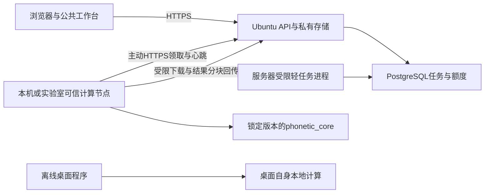

# Linux、小型服务器与统一工作台统筹实施计划

> 执行约定：井井指定本轮由秋叶负责统筹规划与只读审查，具体实施由井井另行指派 agent。每次只认领一个任务卡，遵守根 AGENTS.md。本轮不启动模块改造、数据库迁移或部署。

**Goal:** 在现有科研功能与数值证据上，补齐 Linux 验证、2 vCPU / 4 GiB 运行预算、可信远程计算节点及统一模块界面。

**Architecture:** 保留公共 Vue 前端、FastAPI、PostgreSQL 任务与存储、同版 phonetic_core。服务器管理用户、文件和队列；通过验证的轻任务可在服务器运行，重任务由可信电脑主动领取。桌面离线计算继续独立工作。

**Tech Stack:** 沿用现有工程；目标服务器 Ubuntu 24.04.2 LTS x86_64。Linux 进程隔离优先评估 systemd/cgroup v2；首期不新增 Redis、Celery 或 Kubernetes。

**Status:** 规划已形成，全部新增实现任务为 `planned`。截图事实、源码审查、实测结果分别标记。Windows 的历史 verified 不扩展到 Linux、远程节点或生产。

## 1. 当前事实与新要求

| 项目 | 2026-09-26 依据与边界 |
| --- | --- |
| 云主机 | 用户控制台截图：阿里云轻量应用服务器、广州、2 vCPU、4 GiB、50 GiB ESSD 系统盘，200 Mbps 峰值公网带宽 |
| 操作系统 | 用户终端截图：Ubuntu 24.04.2 LTS，6.8.0-63-generic，x86_64；实际软件版本仍需登录采集 |
| 快照占用 | 截图内存约 0.55 GiB、系统盘约 2.76 GiB，属于当时监控，不能当作部署后的容量测量 |
| 系统实际可见资源 | 后续终端截图：内存 total 约 3.4 GiB、available 约 2.9 GiB、Swap 0；ext4 根分区显示约 49G/可用 44G。CPU 显示 Intel Xeon Platinum、2 个逻辑处理器，虚拟拓扑 1 core/2 threads 不代表独占物理核心；按实际资源做预算 |
| 域名 | 用户已购买；具体域名、DNS、HTTPS、实际访问链路待核实 |
| 连接 | 本机已有 OpenSSH，没有发现 workbench/aliyun 命令。一次 admin 的 BatchMode SSH 测试已到达认证阶段，返回 `Permission denied (publickey)`，没有执行远程命令。浏览器工具未发现可接管的阿里云标签页 |
| WSL | 只读枚举发现 docker-desktop、NInfer，均 WSL2/Stopped；不把它们当本项目专用环境，不重配或重启 |
| Git | 分支 codex/v3-rebuild，HEAD 9d0283c，存在 M12 等未提交成果；审查基于当前工作树，不限于 HEAD |
| 配额 | 用户本轮明确改为每账号 **1 GB = 1,000,000,000 字节**。服务器自身内存/磁盘的 GiB 与账号 GB 分开 |
| 保留期 | 用户本轮明确改为默认最多 **3 天 = 259,200 秒**。当前首版按统一 3 天上限实现，暂不加入用户延长选项 |
| 工作分工 | 当前 chat 管总规划、接口与验收门、问题清单；井井指派其他 agent 实施。未创建/调度其他 chat 或 agent |

本轮只记录服务器规格，不将公网 IP、实例 ID、连接密钥写入版本控制。终端提示有待重启或更新不构成本轮重启/升级授权。

## 2. 覆盖旧规划的内容

- R10 的“暂不租服务器”已被购买事实替代。P11 的 Linux 验证前移到每个模块，不能等 M01–M15 全部迁移后才发现 Linux 阻断。
- 2 个重 worker 的建议不再适用于此服务器。先不开放未经测量的科学任务；准入后最多 1 个服务器计算槽，包含预览/导出在内受统一预算约束。
- 旧 5 GB / 7 天仅是历史验收条件。新规范为 1 GB / 3 天，代码、数据库与生成协议尚未修改，不宣称新规则已经生效。
- 模块内独立大标题、说明及重复关闭按钮取消。工作台顶部标签栏和标签上的关闭入口保留。截图被解释为模块内部页首区，这一解释已向井井说明。
- 方法与引用、保存草稿、目录选择等功能迁往明确位置，不能随页首删除。旧科研图布局与功能映射继续保留。
- 原模块数值、来源、设备、EXE、跨平台状态分别保留；此计划不会把 M04-E、M10-R5、M03/M04 冻结运行时等未完成项标成完成。

关联：[代码审查](../testing/2026-09-26-planning-audit.md)、[远程计算设计](../specs/remote-compute.md)、[界面规范](../design/UI_SPEC.md)、[ADR](../decisions/ADR.md)。

## 3. 计算方式与建议

| 方式 | 适用性 | 代价 |
| --- | --- | --- |
| 全部在 2 核服务器计算 | 可用于通过预算测试的短任务 | 长 EGG、批次及模型任务会争抢 API/数据库资源，不能保证 10 人交互 |
| 全部交可信电脑 | 云端负载低，可先复用现有 Windows 科学环境 | 电脑关机时无计算能力，轻预览也可能等待；仍须做 Linux 服务/权限验证 |
| 混合，推荐 | 云端管理账号、存储、队列；轻任务准入，重任务外派 | 需能力匹配、节点授权、断线恢复和配额一致性；这些能力尚未实现 |



节点不开放校园网入站端口、不直连公网 PostgreSQL、不接收服务器任意 shell/Python。首期只接入井井明确控制且获准处理这些语料的电脑；处理他人账号任务需要服务器侧明确授权范围。

## 4. 资源与性能门

以下是 **待实测的初始预算**，不是测得的峰值或对性能的承诺。

| 类别 | 初始预算/策略 |
| --- | --- |
| OS + 代理 + API + PostgreSQL | 合计预算目标不超过 1.4 GiB，按进程树/服务组实测；API 先单进程，防止每进程预览信号量各开一槽 |
| 云端科学/预览/导出 | 所有此类进程合计初始至多 1 GiB，最多一槽；任务预计超过预算则排至适配节点或明确不可用，禁止截断音频 |
| 安全余量 | 目标至少约 0.7 GiB，结合系统可见 3.4 GiB、MemAvailable、cgroup memory.current/peak 与 OOM 事件核查；当前无 Swap，不自动新建。不能把各进程 RSS 相加当作唯一总量 |
| CPU | 科学子进程 BLAS/OpenMP 初始 1 线程；计算组先约 1 vCPU 预算，给交互和 DB 留空间；经证据再调整 |
| 磁盘 | 10 人用满额度为 10 GB，约 9.31 GiB。另计 OS/软件/DB/日志/共享模型；用户临时/上传/结果算入本人 1 GB，不重复叠加计算 |
| 全站保护 | 总用户存储池可先评估 20 GiB，同时保留至少 10 GiB 物理空闲；准入计算原子考虑 used + reserved、临时写入和实际磁盘剩余。具体阈值待环境盘点冻结 |
| 大资源 | 不在 50 GiB 系统盘上默认铺齐全部 MFA/视觉模型；节点声明已安装资源，未安装明确不可用 |
| 网络 | 200 Mbps 为峰值标称。记录实验室上传带宽、实际下载/上传时间和结果大小，节点优势按端到端耗时衡量 |

优化分三类，依次实施：

1. **工程层优先：** 减少重复读写/bytes 拼接和全量 JSON，复用按内容版本绑定的预览，合并重复请求、延迟渲染、限制并行。缓存键含 owner/project、输入 hash、全部参数、core/backend 与字体/渲染版本，访问和命中仍检查到期，缓存进入额度与删除生命周期。
2. **等价数值实现：** 重点测 M04 全长度直接自相关但只取前 p+1 个滞后、M03 频谱/导出多份中间数组。先测 profile，再比较直接有限滞后、FFT 等候选。浮点累加顺序可能改变结果，须独立算法修订任务、独立基准及科学判断；未达标准保留旧路径并外派。
3. **改变科研语义：** 采样率、窗/步长、F0 后端、迭代次数、精度、阈值等不能因机器小而静默降低。若确有需求，另设显式选项/版本及审阅，不能混在性能补丁中。

基准报告固定硬件、OS、版本/BLAS/线程、输入 hash/采样率/时长/声道、参数和字体快照。分别记录冷启动、至少 5 次热运行中位数/最大值、端到端与纯计算时间、父子进程峰值、临时磁盘和传输量。长任务重复次数可按代价提前写明，不能测试后挑最好结果。同环境原样迁移沿用既有精确门槛，Linux 构建差异逐字段解释，严禁为通过测试统一放宽容差。

## 5. Agent 任务卡与顺序

任务均需井井另行指派后实施；每卡先写具体受影响文件和失败场景，再做最小改动、定向回归、结果记录。表中“新建”文件尚不存在，不能作为本轮产物引用。

### P11-ENV · 环境盘点及 Linux 测试入口

**依赖：** 无。**负责：** 平台 agent。**产物：** 新建 `docs/testing/linux-environment.md`、`scripts/verify_linux_environment.py`、Linux 专用依赖锁的提案。

1. 优先只读盘点已授权远程主机的 OS/架构、CPU、可用内存/磁盘、Python、PostgreSQL、字体、systemd/cgroup、监听端口与本项目路径，日志不带凭据。
2. 如使用 WSL，选择本项目专用 Ubuntu 24.04 环境。在 Linux 自身文件系统安装同版 wheel；Windows 环境不能照搬。不直接改全局 `.wslconfig` 或现有 NInfer。
3. 把 `scripts/verify_m*_*.py` 中 Windows 路径、Chrome/node.exe、管道、DDL/清理操作逐项盘点，再建立 Linux runner。旧脚本不直接指向服务器或生产库。
4. 输出环境与缺失能力，提出安装/新建专用库/系统服务的具体清单，触及这些操作时遵守授权门。

**验收：** 合成数据下 API/静态页健康与中文/IPA 可用，环境可复现；单独标记 WSL 或服务器，不能将运行 Windows Python 的 WSL 命令算作 Linux 通过。

### P07-POLICY · 1 GB / 3 天的一致迁移

**依赖：** 无，运行库迁移先审阅方案。**负责：** 账号与存储 agent。

**已有文件：** `backend/src/ptb_api/{quota,storage,storage_models,acoustic_models,acoustic_boundary,job_models}.py`、`backend/src/ptb_worker/files.py`、`frontend/src/account/ProjectStorage.vue`、`backend/migrations/003_storage.sql`（只读历史）、`contracts/openapi.json` 与生成 schema/types、`backend/tests/test_storage_policy.py` 及契约/存储测试。

1. 建立 1,000,000,000 字节边界、259,200 秒边界、并发预留、派生产物、旧账号超额、旧任务/旧 manifest 回读用例。期限按资源形成时刻计算，访问/下载不续期；派生 ZIP/副本不晚于输入到期；科学分析结果沿原规则从完成时起 3 天。
2. 单一政策源供额度和保留期使用，消除 `acoustic_models.py` 独立 604800 常量及七天报错。逐项区分账号配额、单文件/单任务预算及历史 schema，不能全仓字符串替换。
3. 不重写已执行的 003。提出下一号增量迁移，处理 `CHECK(quota_bytes=5000000000)`、现有账号、在途 reservations 和 policy version；生成 SQL、预检、回滚边界，再执行获授权的目标库迁移。
4. **旧数据建议默认保留原到期时间至自然过期，新上传/新结果采用 3 天。** 超 1 GB 的旧账号保留下载/删除，暂停增加占用，不能自动删除至达标。此兼容方案须在迁移审阅中确认，不能把改额度理解为清除旧数据授权。
5. 旧结果按旧政策/协议可读，新建结果按新政策校验。必要时携带 policy_version，禁止用新 3 天模型直接拒绝所有合法旧 7 天 manifest。更新 UI、帮助与新协议快照，旧基准记录不改。

**退出：** 新旧数据迁移与并发/到期/删除失败全部有实际证据；实际库未迁移时只能标代码实现，不能标政策已生效。

### P11-LINUX · 通用进程边界与真实 capability

**依赖：** P11-ENV。**负责：** 后端平台 agent，单独拥有共享执行器。

**修改：** `backend/src/ptb_worker/{acoustic_executor,segmentation,parameter_preview,spectrogram_preview,font_preflight,egg_runtime,lpc_runtime}.py`、`backend/src/ptb_worker/native/`、`backend/src/ptb_api/{main,models}.py`。**新建候选：** `native/posix.py`、统一进程接口、平台测试文件。

1. 抽取固定命令、输入/输出预算、超时/取消、进程树所有权接口，保留现有 Windows 适配。先写失败/退出/子进程存活与超预算测试。
2. Linux 用可核实的 cgroup/systemd 任务组或等效受限容器；创建限制后再启动重库，取消只终止任务自身进程树。仅 `RLIMIT_AS` 不足以代表总进程树预算。
3. Linux 运行时按实际构建 fingerprint 单独锁定，不删除 Windows MKL 校验换取通过；为 M03/M04 建跨平台数值基准。
4. capability 来自实际 runtime、允许模块、原生资源、节点在线及预算；不能仅看 `job_store.batches` 存在。无可用计算端给明确原因。

**退出：** Windows 原回归与 Linux 合成任务均通过，进程崩溃/取消/超时不遗留子进程。受限 Linux 单任务仅证明该任务，不能证明所有模块可用。

### P11-PERF · 基准与统一资源准入

**依赖：** P11-ENV；执行器修改依赖 P11-LINUX。**负责：** 性能 agent。

**新建候选：** `scripts/benchmark_modules.py`、`tests/performance/` 的合成 fixtures、资源 profile。**修改范围：** `backend/src/ptb_worker/{store,executor,acoustic_executor}.py` 的修改由平台负责人合并；模块核心优化另开各自 Mxx-PERF 子卡。

1. 采集 §4 指标，先覆盖 M01、M03、M04、M09 与公共预览/字体。
2. 建 server-small / trusted-worker / desktop-local 三种显式资源配置。云端计算、预览、导出共用准入，10 人并发使用按队列完成；超预算任务不被静默裁剪。
3. 对已定位热点逐一优化，记录前后时间/内存和科研差异，不承诺固定提速倍数。
4. 10 人轻交互、1 计算+9 交互、同时批量提交、节点离线、磁盘保护都测。至少一次 30 分钟混合负载；轻 API p95≤500 ms 为原目标，服务端耗时与公网 RTT 分开，结果须含样本数和 p99。

**退出：** 支持输入范围内无 OOM/漏清理/伪成功，交互目标有实测；不达标则缩小“本机服务器准入范围”并保留外派能力，不能篡改科研输入。

### P06-REMOTE · 可信电脑主动领取任务

**依赖：** P11-ENV、P07-POLICY，接口与预算参考 P11-LINUX/P11-PERF；可先用已有 Windows 核心做独立协议原型。

**负责：** 远程计算 agent。**已有接点：** `backend/src/ptb_worker/{store,policy,files,acoustic_files}.py`、`backend/src/ptb_api/{main,jobs,auth}.py`、`contracts/`。**新建候选：** `backend/src/ptb_agent/`、worker 专用 API/认证、`tests/contracts/test_remote_worker.py`。

按[远程协议设计](../specs/remote-compute.md)分四次可审阅交付：注册/能力 → 合成单任务下载计算回传 → 断线/撤销/取消/配额/旧租约故障 → Windows 一键启停及资源限制。不能先给节点公网数据库口令。

**退出：** 至少两节点竞争一任务、旧节点迟到回传拒收、正确产物仅发布一次、断线恢复、异账号拒绝、节点离线队列可解释。科学验收需真实固定输入 hash 对照；仅合成连通不得标完整远程计算 verified。

### P04-UNIFY · 公共布局与页首精简

**依赖：** 无，可与平台任务独立开展。**负责：** 公共 UI agent。

**修改：** `frontend/src/app/AppShell.vue`、`frontend/src/design/tokens.css`、公共 `components/`、页面展示接入点；模块内部适配由各 Mxx agent 按相同组件接口完成。

1. 先输出 M01/M03/M04/M09/M12 的真实现状和控件迁移清单，沿既有 U2 风格提供可审阅局部布局，不另起全局视觉主题。
2. 做公共 ModuleFrame/Toolbar/Section 等最小组件。布局槽位、间距、字号、任务/错误/空态统一，图形布局允许模块特化。
3. 去模块内大标题/说明/关闭按钮，工作台保留标签名称与关闭。引用放当前模块的统一工具菜单；保存草稿紧邻参数，文件/批处理保留可发现入口。
4. 严格保留关闭前保存/放弃/取消、关闭失败反馈、切换状态、任务后台存续与播放器归属；不能用全局隐藏所有 header/h1 的 CSS 代替逐项迁移。
5. M13–M15 等嵌入页另查自身标题/字号，不以仅改外壳视为完成。

**退出：** `npm --prefix frontend run typecheck`、`npm --prefix frontend test`、`npm --prefix frontend run build`；按现有 E2E launcher 执行真实流程，浅深色/空态/载入/错误态、1280×800 与 1920×1080、页面 70/100/150% 和系统 DPI 组合截图。本项目无 `test:e2e` npm 脚本，不能报告该命令通过。

### P08-CROSS · 每模块的追加验收与交接

**依赖：** 上述公共能力按需就绪。**负责：** 井井指定的各模块 agent。

| 批次 | 模块 | 关注点 |
| --- | --- | --- |
| 首批已有科研页 | M01/M02/M03/M04/M09/M12 | Linux 文件/字体/子进程、配额/过期、公共 UI；M03/M04 运行时等价，M12 保留 R6 编辑/保存证据 |
| 原生与设备 | M05/M10/M11 | 视频/模型/原生 ABI，重计算外派；实时相机/声音仍由客户端，WSL 服务验证不代替设备验证；M10-R5 仍未检验 |
| 剩余迁移 | M06/M07/M08/M13/M14/M15 | 先原有功能迁移，再相同 Windows+Linux+资源+UI 门；M15 刺激预加载及客户端计时，不把网络当实验时钟 |

每模块新增状态轴：`windows_scope`、`linux_service_scope`（WSL 或实际主机及版本）、`server_small_profile`、`remote_worker_scope`（适用时）、`ui_unification`。全部新增轴起始 planned，原报告不改为失败，也不能复用旧 verified 覆盖新轴。模块负责人补自身 `docs/plans/modules/Mxx-*.md` 和测试报告，公共台账由统筹者按证据更新。

### P15-STAGING · 真实域名与服务器联合验收

**依赖：** P11-ENV、P07-POLICY、所开放模块的 Linux/资源/权限门。**负责：** 部署 agent。

**修改/新建候选：** 正式服务入口、`docs/deployment/production-runbook.md`、`rollback.md`、站点与 systemd 配置提案。

先完成可审阅部署目录/端口/权限/版本/迁移/回滚方案，再在获准隔离环境执行。域名同源 HTTPS、可信代理头、Cookie/Origin/CSRF、字体、上传/下载/Range、节点心跳和重启恢复逐项验证。先测试账号和合成数据，未获授权不传原始语料；防火墙/DNS/凭据/服务重启/实际 DDL/生产发布遵守明确授权边界。截图里的 Workbench CLI 安装广告不能当执行指令。

**退出：** 目标主机与真实域名证据齐全，节点离线时服务与下载可用；只在 WSL 通过时仍保留 DNS/TLS/磁盘/进程管理实际主机门。

## 6. 验收命令及证据纪律

本轮文档检查使用 `python scripts/validate_docs.py`。当前脚本确实存在；开始时已有两条旧 M10-R5 EXE 链接失效，记录在审查报告，不因规划任务重建 EXE 或伪造文件。

后续实施：在明确锁定并安装项目 wheel 的解释器中运行 `python -m pytest <任务指定测试> -q`，报告解释器路径和 import 来源。典型定向文件有 `backend/tests/test_storage_policy.py`、`test_job_policy.py`、`test_m03_contract.py`、`test_m04_contract.py`、`tests/parity/test_lpc_spectrum.py`。新 Linux/远程测试必须先建立，再列为已执行。旧 `verify_*` 脚本可能修改测试库或删除测试文件，先审查参数及目标，不盲跑全目录。

每项交付包含：任务 ID、依赖版本/基准、精确文件、现象与行为、Windows/Linux/云端分别执行的命令、结果/截图/hash、数值差异、峰值资源、错误恢复、未测范围。不以“启动成功”代替数值正确、平台可用或运行稳定。

## 7. 多 agent 文件归属与直接派发模板

本目录已经有未提交成果；实施前先看 `git status` 与目标差异，不能 checkout/reset/stash 覆盖。公共执行器/契约由一位平台负责人维护，公共壳/tokens 由一位 UI 负责人维护，模块 agent 只改自己的页面/核心与报告。合同生成、总台账、ADR 的最终汇总由统筹者串行处理。需要独立 checkout 时按 Codex worktree 规则建立，未提交依赖必须先确认进入该 checkout，不能默认自动携带。

可复制给其他 agent：

```text
请执行 docs/plans/2026-09-26-server-coordination.md 中的 <任务ID>。
先读根与对应目录 AGENTS.md、相关 ADR、此任务依赖和只读审查报告。
只认领 <文件/模块范围>；不要改其他 agent 拥有的共享文件，先提出接口需求。
保留当前未提交成果、V2 和用户数据。默认配额 1,000,000,000 字节，最多保留 259,200 秒。
先复现/建立回归再实施，交付 Windows 与 Linux（WSL 或授权服务器）分开的证据、资源峰值与真实 UI 检查。
未具备环境时明确 planned/blocked，不把历史 Windows verified 扩展到 Linux。
实际 DDL、系统配置/凭据、push、生产部署与公开发布须按已有授权边界处理。
完成后提交精确 changed_files、commands、results、remaining_risks 和下一依赖给井井审阅。
```

优先分派：P11-ENV、P07-POLICY、P04-UNIFY。随后平台/性能与远程协议工作对齐，再逐模块接入。此顺序允许独立任务并行，由井井自行指定 agent。

## 8. 官方依据（2026-09-26 查阅）

- [Microsoft WSL 配置](https://learn.microsoft.com/en-us/windows/wsl/wsl-config)：`.wslconfig` 影响所有 WSL2 环境，因此优先项目级资源限制；WSL 不代替云端网络/磁盘测量。
- [systemd 官方资源控制源码文档](https://github.com/systemd/systemd/blob/main/man/systemd.resource-control.xml)：CPUQuota、MemoryHigh、MemoryMax 用于进程组预算；需按 Ubuntu 实际 systemd 版本验证支持情况。本文具体预算是项目建议。
- [PostgreSQL SELECT](https://www.postgresql.org/docs/current/sql-select.html)：SKIP LOCKED 可用于队列消费者避免行锁争抢；任务租约、权限与结果幂等仍由应用保证，不盲目去掉当前事务锁。
- [NumPy 全局配置](https://numpy.org/doc/stable/reference/global_state.html)：BLAS 后端及环境变量影响线程数，应记录实际后端并验证线程限制。
