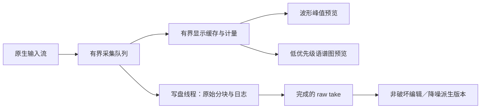

# M16 录音模块详细规划

> 2026-10-02 实施更新：井井已明确授权两个模块直接实施，覆盖本文件原先的布局审批与实施暂停。M16 本地开发态实现及 Windows/WSL 限定验证已完成，完整模块仍 `in_progress`，实体录音硬件/自然音质/60分钟墙钟与正式发行待验。最新默认是双声道音频，EGG 手动可选，单输入设备明确回退单声道。当前功能、实测结果与边界以 [M16 验收报告](../testing/m16-report.md)、[使用手册](../manual/recording.md) 和 [ADR](../decisions/ADR-M16-local-recording.md) 为准。以下保留原规划及当时的授权边界作为历史记录，不再作为实施暂停指令。


> 执行约定：本文件为井井要求的规划交付，后续实施须另获明确授权，并按根 AGENTS.md 与 executing-plans 工作流分阶段执行。本轮没有启动录音、修改业务代码或构建 EXE。

**Goal:** 在统一 v3 工作台内提供简洁、可恢复的麦克风／EGG 录音、可选任务清单、实时查看、剪辑、噪声采样降噪及批量导出。

**Architecture:** 共用 Vue 页面，经能力接口接入桌面原生音频设备和本机工程目录。采集与写盘在本机进行，纯音频处理进入科学核心，设备、文件和会话生命周期由桌面适配器负责。原始采集文件不可被编辑或降噪覆盖，不接入服务器计算队列。

**Tech Stack:** 既有 Vue 3／TypeScript／PyQt6／Qt WebEngine；sounddevice／PortAudio、soundfile 与 NumPy／SciPy 为待核对现有锁定环境的复用候选，不沿用旧程序的 PySide6 界面。

**Status:** `planned`，2026-10-02。M16 为建议的新模块编号，尚未注册。源码只读定位已完成，真实设备、性能、功能和发行均未验证。

配套独立规划：[M17 国际音标 Plus](2026-10-02-m17-ipa-plus.md)。

## 1. 本地运行结论与首版范围

完整桌面版可以在用户自己的电脑上完成全部请求，不需要阿里云服务器、网络登录、云端额度或远程节点。桌面宿主已有的 localhost 服务只是本机内部通信，不是向公网上传音频。本地工程不应用网页的 1 GB／3 天策略。

| 能力 | Windows 桌面首版 | 普通网页版 | 服务器职责 |
| --- | --- | --- | --- |
| 手工任务、表格导入、提示和进度 | 本地完成 | 可本地完成 | 静态页面分发即可 |
| 普通麦克风录音、波形和试听 | 原生设备适配 | 浏览器授权后可本地完成 | 不接收实时音频 |
| 同声卡麦克风＋EGG 同步双通道 | 首版重点验收 | 设备／浏览器满足条件才可能提供，不能预先声称等价 | 无 |
| 精确设备、采样率、输入／输出路由 | 原生探测与回读 | 能力受浏览器和驱动限制 | 无 |
| 可恢复的长录音工程、剪辑、降噪和批量导出 | 首版完整目标 | 后置的本机浏览器能力阶段，需单独解决持久化和计算预算 | 不以偷偷上传作为回退 |
| 国际音标 Plus | 见 M17，纯客户端 | 见 M17，纯客户端 | 静态资源分发即可 |

本方案建议先验收 Windows 桌面完整版。macOS／Linux 桌面保留同界面、独立设备验收目标。WSL 只能证明部分非设备逻辑，不能代替实体 Linux 声卡测试。

浏览器的 `getUserMedia` 需要安全上下文和用户授权，设置请求还要和实际 `getSettings()` 回读对照。输出设备选择也有浏览器支持边界。这些限制不意味着必须使用服务器处理音频。[浏览器采集接口](https://developer.mozilla.org/en-US/docs/Web/API/MediaDevices/getUserMedia)、[采集约束](https://developer.mozilla.org/en-US/docs/Web/API/MediaTrackConstraints)、[输出选择](https://developer.mozilla.org/en-US/docs/Web/API/AudioContext/setSinkId)。

## 2. 已找到的旧程序与可复用范围

已定位 `voicevista/egg_recorder` 工程，其 `README.md`、`AGENTS.md`、`pyproject.toml` 及实际录音源码与用户指定 EGG 程序的功能相符。完整私有路径及本轮文件指纹保存在忽略的 `output/planning/2026-10-02-m16-m17/`，不把博士论文路径、真实任务内容或录音放进公开源码。下文用 `<RECORDER_SOURCE>` 表示该工程根目录。

**证据边界：** 已找到源项目并阅读关键实现，尚未建立用户指定 EXE 与当前源代码某次提交的可重现构建对应。本轮未运行旧 EXE，也未读取其 `.egg_recorder/state.sqlite3` 或真实录音。

| 旧实现位置，均相对于 `<RECORDER_SOURCE>` | 已读到的行为 | 新模块处理 |
| --- | --- | --- |
| `src/egg_recorder/audio/backend.py`、`devices.py`、`sounddevice_backend.py` | 设备抽象、格式探测与 PortAudio 适配 | 复用接口设计，按存在的文件和真实设备能力迁移 |
| `src/egg_recorder/audio/recorder.py` | 录音状态、溢出事件、恢复文件、停止和设备异常处理 | 保留安全状态设计，拆除实验员／被试依赖 |
| `src/egg_recorder/audio/wav_writer.py` | 有界队列、工作线程写 WAV、原始／增益后统计 | 可迁移写盘机制；必须改为原始采集先独立保存 |
| `src/egg_recorder/audio/processing.py`、`metering.py` | 双通道线性数字增益、增益前后风险分别计量 | 保留计量思路，支持单声道与明确的通道角色 |
| `src/egg_recorder/audio/playback.py`、`review.py` | 通道试听、回看和播放位置 | 适配 v3 播放所有权、选区和输出设备 |
| `src/egg_recorder/experiments/workbook.py` | 严格的多工作表／矩阵导入 | 只参考逐行错误报告与文件名校验，改为简单清单 |
| `src/egg_recorder/storage/publisher.py`、`sessions/recovery.py` | 正式版本发布、历史和异常恢复 | 保留“先完成新版本、旧版本可恢复”的原则，重新适配工程格式 |
| `src/egg_recorder/ui/`、`security/` | PySide6 多页、管理员 PIN、锁定参数、实验矩阵 | 不迁入新模块 |

旧程序明确固定 44,100 Hz、双声道、32-bit float WAV，其写入器实际执行 `handle.write(processed.samples)`。即使保存了历史版本，也不能据此声称已有增益前原始 PCM。新方案会明确改变这一行为并建立单独验证，不能标成原样迁移。

旧程序空格控制开始／停止／重录，回车试听。井井此次要求覆盖旧快捷键：新模块空格只控制播放与停止播放。

旧源环境要求 Python 3.12+、PySide6；v3 宿主使用 PyQt6。不能整包导入，不能为迁移而将两套 Qt 绑定塞进同一进程，也不能动态依赖开发机的旧源目录。

## 3. 功能清单与明确排除项

| ID | 井井的需求 | 首版行为 |
| --- | --- | --- |
| R01 | 连接 EGG 或麦克风 | 麦克风单声道、同声卡双通道录音；可标记角色为麦克风、EGG、其他 |
| R02 | 一条条设任务并保存 | 新增、编辑、复制、排序、启用／停用；保存清单模板，重新打开复用 |
| R03 | 表格导入 | XLSX／CSV／TSV，列映射与导入预览，逐行错误反馈 |
| R04 | 不设任务也可录、允许跳过 | 打开即可自由录音；清单行支持跳过、恢复为待录，已有音频继续保留 |
| R05 | 录前检测与调幅 | 显示输入电平、原始峰值／RMS、数字增益预览、削波与静音提示 |
| R06 | 选择录制和播放设备 | 输入与扬声器／耳机分别选择；刷新设备、支持格式探测、断开处理 |
| R07 | 实时波形和语谱图 | 上下共用时间轴；语谱图可关闭，关闭后停止该显示计算 |
| R08 | 选噪声段后一键降噪 | 采集噪声样本、预听、生成派生版本、撤销、恢复原始 |
| R09 | 剪切、删除某段 | 选区剪切、删除、保留选区、片段另存；操作可撤销，多通道时间一致 |
| R10 | 保存与任务批量保存 | 当前条／选区／任务选定版本／全部版本，明确格式、命名和部分失败 |
| R11 | 重录 | 同一任务追加 take，旧 take 与编辑历史仍可选择 |
| R12 | 空格播放或停止 | 有非空选区播放选区，否则播放整段；正在播放时空格立即停止 |

不引入管理员密码、实验员／被试双身份、参数锁定、必须填完的实验矩阵、云端账号、自动语音识别、复杂多轨混音或通用 DAW 效果链。

暂停续录暂不作为首版必需项。默认一次开始到停止形成一个 take，随后可重录，避免无意拼接造成“连续采集”的误解。

## 4. 页面和操作流程

沿用 [统一布局接口](../design/module-layout-contract.md)、[UI 规范](../design/UI_SPEC.md) 和当前公共拖动分栏／主题／字号规则。

```text
工作台标签：录音
工具栏：新建／打开工程  导入／保存任务清单  设备与录前检测  保存／批量导出  帮助
┌────────────────┬──────────────────────────────────────────┐
│ 任务清单／自由录音│ 当前任务提示文本、序号、take 与状态             │
│ 搜索、进度       │ 实时／录后波形：麦克风、EGG，角色与幅值可见      │
│ 待录／跳过／完成  │ 语谱图：可开关，默认针对麦克风通道               │
│ 当前任务的版本列表│ 整段总览与时间选区                              │
├────────────────┴──────────────────────────────────────────┤
│ 开始录音  停止录音  播放／停止  重录  跳过／下一条  选区工具  降噪 │
│ 时长、采样率、通道、峰值、输入削波、缓存写入状态、磁盘剩余         │
└───────────────────────────────────────────────────────────┘
```

这是布局说明，不是已实现页面或视觉验收图。后续先提供贴合当前 v3 的真实布局预览，经审阅再实现完整交互。

- 任务栏可折叠并调整宽度，自由录音时简化为 take 列表。
- 录前检测用本页抽屉，检测完成后回到同一页面，避免多个必须依次完成的子模块。
- 录音区域高度稳定；打开语谱图后在同一区域分配高度，关闭后波形扩展，不推动工具栏跳动。
- 当前任务提示支持多行文本和 IPA，但把导入文本作为纯文本处理。
- 默认录完停留当前条供试听。保留明显的“下一条”，首版不自动开始下一条录音。
- 每条任务可拥有多个 take。新 take 停止并落盘后成为当前查看对象，批量导出的“选用版本”用单独标记表示。
- 单条完成可以表示已有选用录音，导出状态另列，不能把写入工程缓存显示成已导出。

### 空格与选区的精确定义

1. 已有可播放数据且当前没有播放：空格播放 `[start_frame,end_frame)`；选区为空或没有选区时从整段起点播放。
2. 正在播放：空格停止，不把同一次按键继续处理成重新开始；长按的重复 keydown 忽略。
3. 光标在任务文本、文件名、数值输入、搜索、对话框文本区或输入法组字中：空格保持正常输入，不触发播放。
4. 本模块未激活时不响应快捷键。录音期间空格不启动播放，也不结束录音；停止录音用明确按钮，避免误用。
5. 录后删除默认 Delete／Backspace，剪切 Ctrl+X，复制 Ctrl+C，粘贴 Ctrl+V，撤销 Ctrl+Z／重做 Ctrl+Y；仅音频画布拥有编辑焦点时拦截，macOS 对应 Meta。
6. 启动录音前停止本应用内其他试听并取得设备所有权；不关闭其他应用的声音。输出切换、任务切换和版本切换停止旧播放，迟到回调不能复活旧声音。

## 5. 任务清单与批量管理

### 5.1 简单表格

一张工作表即可。不继承旧程序必须包含实验设置／矩阵坐标的格式。

| 字段 | 中文列名示例 | 必需性与规则 |
| --- | --- | --- |
| `prompt` | 文本／录音内容 | 有任务模式至少要有此列或任务名称，允许个别空白提示 |
| `task_id` | 任务编号 | 可省略后自动生成；若提供则在清单内唯一 |
| `title` | 任务名称 | 可选，列表显示短标题 |
| `filename_stem` | 文件名 | 可选，缺省使用安全序号；禁止路径、保留名和冲突 |
| `repeat_count` | 次数 | 可选，默认 1；导入预览展开重复任务实例 |
| `group` | 分组 | 可选，只用于列表与导出目录组织 |
| `note` | 备注 | 可选，纯文本 |
| `enabled` | 启用 | 可选，默认启用 |

示例不使用真实被试资料：

```csv
task_id,prompt,filename_stem,repeat_count,group
T001,请持续发元音 a,vowel_a,3,元音
T002,请朗读屏幕上的短句,sentence_01,1,句子
```

导入先显示工作表、列映射、总条数、重复编号、文件名冲突和无效单元格。只在确认预览后提交新清单，失败不覆盖旧清单。公式／宏不执行，公式单元格要求转为文字或明确处理缓存值；不解析任意外部链接。CSV 编码先支持 UTF-8／BOM，其他编码需用户明确选择并预览，不能静默乱码。

工程保存任务清单快照。后续修改模板不会追溯修改已录 take 的提示、任务 ID 或设备快照。删除有音频的任务行只从当前清单移出并保留可恢复关联，不能连带删录音。

“跳过”是任务状态，不是删除；随时可回到该条开始录音。自由录音默认命名 `recording-001` 等，也能在之后关联已有任务，不要求补填清单才能保存。

### 5.2 批量导出

- 默认每个未跳过任务导出其选用 take 的当前编辑版本，同时提供“原始版本／全部 take”的明确选择。
- 导出预览展示缺录、跳过、未选版本、质量提醒、文件冲突及预计容量。
- 缺录与跳过行列入清单，不伪造空 WAV，不把部分导出显示成全部完成。
- 文件名建议 `{序号}_{任务名}_take{编号}_{raw|edited|denoised}.wav`；允许自定义模板，先检查路径安全和冲突。
- 默认写入新目录或自动添加编号，不静默覆盖现有文件。即使用户选择覆盖导出副本，也不得触及原始工程音频。
- 大批次逐文件流式导出，逐项记录成功／失败并可重试。失败保留已完成文件与明确清单，避免整批重新生成造成重复。
- WAV 附导出 manifest CSV／JSON，记录 task、take、版本、通道、采样率、编辑／处理、帧数、哈希和质量事件。导出的 CSV 文本处理电子表格公式注入，工程内部保存原始文本。

## 6. 设备、录前检测与振幅语义

### 6.1 同步与格式

- 单麦克风可用单声道。EGG 单独输入也可保存为单通道；EGG 与麦克风联录要求同一多通道设备上的通道映射，首版重点是两通道。
- 物理 Input 1／2 与麦克风／EGG 角色由用户确认，不能按顺序或设备名称猜测。接入 M03 时需满足它的声道契约并显式映射。
- 两个独立 USB 设备存在独立采样时钟。首版不把它们直接合并后称为同步 EGG。若未来支持，需独立设计漂移测量、补偿和原始记录。
- 设备候选名称只作提示，真正支持取决于采样率、通道、格式探测及打开结果。设备 ID 失效时要求重新选择，不按列表序号绑定。
- 首选请求 48 kHz，保留 44.1 kHz 和设备明确支持的其他采样率；该默认是待审阅建议。请求与实际打开参数都记录，不静默重采样。
- 原始存储建议 IEEE float32，标准导出提供 float32／PCM24／PCM16。float32 保存并不提高 ADC 实际精度，也不能恢复模拟前级削波。
- 驱动／系统可能已有音效、AGC 或混音处理。软件能关闭的明确关闭并回读，其余状态标记未知／需硬件确认；“原始”限定为应用收到的采集帧。

### 6.2 三种振幅控制分开标注

| 控制 | 改变什么 | 保存与提示 |
| --- | --- | --- |
| 硬件／系统输入增益 | ADC 前端或设备实际提供的信号 | 能力支持才控制；无法控制时说明调节设备旋钮，无虚假成功滑块 |
| 数字增益 | 已收到的样本，线性乘法 | 作为可撤销处理；原始帧先保留；显示处理前后峰值 |
| 波形显示倍率／播放音量 | 仅图形高度／监听音量 | 不改录音样本、削波统计和导出，不能混称录音增益 |

不设置跨任务参数锁。每个 take 保存开始时设备／格式快照。录制期间显示倍率和监听参数可变；采样率、设备和通道结构的修改在停止当前流后生效，并在界面明确提示，防止一个 WAV 内出现混合格式。数字增益不烙入 raw，录后按当前选定设置生成版本；若允许录中修改预览增益，记录时间点，但不伪装成恒定采集条件。

### 6.3 录前检测内容

- 双通道实时波形、峰值、RMS 和峰值保持；dBFS 明确为数字满幅参考，不显示成未经校准的 dB SPL。
- 原始输入接近满幅、数字处理后超幅分别提示，保存事件位置、峰值和计数。数字降幅不能消除上游已发生的削波。
- 静音／极低电平、非有限样本、通道高度相似、设备断开和驱动溢出分别诊断。相关性提示只表示可能接线或 Loopback 问题，不能自动认定硬件故障。
- 普通语音可显示例如峰值约 −12 至 −6 dBFS 的初始操作参考，不能作为所有 EGG 幅值的质量合格线；最终阈值可配置并留在快照。
- 可按按钮做短试听测试并选择输出设备，默认不实时外放，避免回授；需要监听时显式开启且默认仅监听麦克风角色。
- 检测可以跳过。设备权限、格式无法打开、磁盘不可写属于实际无法录制的条件，需要处理后才能开始；削波／弱信号提醒允许保存带标记的录音，不套用旧程序必须重录的质量闸门。

## 7. 实时显示、后台写盘与长录音



音频回调不能等待磁盘、UI、FFT 或 HTTP。原始写盘链路优先，显示可以降低刷新率，不能丢弃音频后仍报成功。PortAudio 回调的实时限制以官方接口说明为参照。[sounddevice 流与回调](https://python-sounddevice.readthedocs.io/en/latest/api/streams.html)。

1. 回调复制到预分配／有界缓冲并带单调帧序号。后台写入、计量、显示消费分开，使用独立队列／可安全共享的块引用分发，不能让写盘与显示两个消费者竞争取走同一条音频块。慢图表不阻塞原始文件。
2. 实时滚动窗建议 5–10 秒，波形 20–30 fps、语谱图 10–15 fps 作为待测目标。关闭语谱图应停止相应 FFT／消息发送，而不只隐藏 canvas。
3. 波形采用保峰值抽点，放大时显示真实样本；横轴用采样帧／采样率，两个通道同轴，不使用 UI 到达时间当录音时钟。
4. STFT 参数在高级设置中有明确单位、窗函数、窗长、步长、FFT 点数和频率范围。默认麦克风通道，EGG 语谱仅作可选显示。标注为实时显示谱，不冒充已有 Praat 分析结果。
5. 原始数据分块写入恢复目录，记录已确认帧数和块校验。停止后完成头部、回读验证、提交 take 清单。崩溃后只能恢复已实际落盘的数据，明确可能丢失最后未落盘尾块。
6. 输入或写盘队列溢出、磁盘满、设备掉线时停止受影响录制，保留已写段和异常标记。不能悄悄补零、重复最后一块、删掉时间间隙或自动切换到默认设备。
7. 48 kHz×2 通道×4 字节约 1.3824 GB／小时，仅原始样本即占此量；派生与临时导出另计。界面按实际格式和磁盘余量估算剩余时间。
8. 首版用可恢复分段避免普通 RIFF WAV 的约 4 GiB 尺寸边界。大于已验输出上限时提供带连续帧索引的分段 WAV；RF64 只有通过读写兼容测试才开放。不能无界积攒 RAM 或到边界才失败。
9. 桌面建议至少验证 60 分钟真实流和跨分段边界的受控输入。内存目标为固定缓存随时长基本不增长，具体预算在 A 阶段测量后冻结，不能套用现有 64 MB 预览预算作为录音总时长限制。

## 8. 非破坏剪辑、降噪与恢复

### 8.1 原始文件和版本结构

建议一个本地目录工程，JSON 清单带 `schema_version`，不为本模块修改现存 SQLite／PostgreSQL schema：

```text
recording-project/
  project.json                    工程及清单当前版本入口
  manifests/                      完整修订清单，上一版仍可读取
  takes/<take_id>/raw/             只追加的原始采集分段
  takes/<take_id>/capture.json     实际格式、角色、质量与帧索引
  edits/<revision_id>.json         编辑决策与源版本依赖
  derived/<revision_id>/           已完成的处理副本
  recovery/                       未完整提交的本次录制／处理
  exports/                        可选，用户也可导出到其他目录
```

工程当前版本入口采用临时文件、flush／必要的 fsync、同卷原子替换；清单中的引用必须先指向已完成产物，再切换当前 revision。Windows 文件占用导致替换失败时报告未保存并保留上一版。恢复时检查路径范围、schema、块哈希和孤立产物，不自动清空历史。

同一工程只允许一个写者，第二窗口以只读查看或明确拒绝编辑，避免多个标签覆盖清单。录音结束后显示“已存入本地工程”，导出成功后再显示“已导出”，两者语义分开。

### 8.2 剪辑

- 非破坏编辑表引用原始文件及整数采样帧区间，采用 `[start,end)`；单位转换只在界面边界进行。
- 删除选区默认移除选区并拼接前后部分；“静音选区”若加入必须是独立明确命令，不能与删除混淆。
- 剪切将片段引用放入模块内音频剪贴板并移除当前区段，支持在同格式工程内粘贴。它不冒充已将 WAV 写入系统文本剪贴板。
- 双通道／多通道的时间剪切、删除、粘贴始终同起终点执行，不能把 EGG 与音频切成不同长度。
- 跨采样率粘贴首版拒绝并解释，不能静默重采样。片段另存和保留选区都保留原始 take。
- 默认不自动淡入淡出、归一化或改变接缝样本。有去点击音选项时作为显式派生处理记录，科学比较可以回到无处理版本。
- 撤销／重做操作历史随工程保存；“恢复原始录音”建立新的编辑头，旧剪辑仍可找回；重录追加 take，不重用并覆盖旧路径。

### 8.3 噪声样本降噪

采用井井描述的交互：选择只有背景噪声的片段 → “设为噪声样本” → “一键降噪”。噪声样本设置完成后清楚显示来源 take、版本、通道和时段，避免把选噪声的区间误当作唯一处理范围。

- 一键默认处理当前 take 的完整编辑版本；可显式改为新的选区。显示处理范围，并允许预听原始／处理后和差分残余。
- 算法优先评估基于噪声谱估计的 STFT 频谱衰减，候选包括谱减与 Wiener 类增益；在 A 阶段小样比较后固定一个保守首版，不在规划中冒称已选定或已等同 AU。
- 提供简单强度与预听，算法参数及版本完整写入元数据。保留 FFT 网格、噪声估计、平滑、边界补齐和重叠相加规则，便于复现。
- 只处理用户指定的麦克风通道，EGG 默认禁止该功能。EGG 通道必须保持逐样本不变，输出仍保持原帧数和通道同步，不能因滤波延迟而移位。
- 噪声段过短、没有有效帧、含明显语音或噪声统计不稳定时给出具体原因。含语音判断只能提示，不宣称自动识别必然正确。
- 降噪不是削波修复，也可能改变气声、擦音、HNR、CPP 和高频细节。处理版本明确标记；交给后续科研分析时默认推荐 raw，并让用户显式选择版本。
- 计算在本机低优先级工作进程进行，首版不与正在采集的录音同时竞争资源。取消／崩溃／超时只留下未提交派生产物，原始与上一个可用版本不变。
- 提交前检查帧数、采样率、通道数、有限值、EGG 不变和文件回读。算法输出错误不能因为“文件存在”而变成当前版本。

AU 仅作为交互参照，不复制其闭源实现，不读取专有噪声文件，也不承诺相同声音结果。[Adobe 官方噪声采样与降噪说明](https://helpx.adobe.com/audition/desktop/effects-reference/noise-reduction-restoration-effects.html)。

## 9. 状态、生命周期与异常

采集状态建议为 `idle → probing → ready → recording → finalizing → ready`，任何状态可进入带恢复信息的 `error`。take 单独使用 `raw_saved / edited / processing / recovered_partial`，导出另有 `pending / exporting / exported / failed`。不要用一个“完成”字段承载所有状态。

| 场景 | 必须可见的结果 |
| --- | --- |
| 拒绝设备权限／设备被占用 | 解释原因和重新选择入口，不进入假录音计时 |
| 格式不支持 | 保留设置，显示实际支持选项；变更需显式确认 |
| 热插拔／设备 ID 改变 | 停止并保留本次片段，重新绑定，不切到另一麦克风 |
| 削波／低电平 | 图上定位和文字提醒，录音仍可保存为带标记的 take |
| 丢块／非有限输入／磁盘故障 | 显示录制不完整，保存证据与可恢复部分，不标为健康完成 |
| 关闭模块／退出应用 | 活跃录制先请求停止并等待提交；保存失败保留页面与错误，不只有 beforeunload 提示 |
| 切换其他模块 | 保留录音页和状态，可继续录制并有全局明显指示；禁止另一个采集页抢用同设备 |
| 睡眠／系统中断 | 恢复后明确中断边界，不宣称连续采集；保留已提交段 |
| 批量导出取消／部分失败 | 保留成功项，列出未完成项和重试入口 |
| 清理工程／历史 | 首版不自动删除原始与历史；未来清理必须显示具体范围并由用户确认 |

## 10. 代码落点与共享改动边界

以下均为未来候选路径，未创建或实现：

| 路径 | 工作内容 |
| --- | --- |
| `frontend/src/modules/recording/RecordingPage.vue` | 模块页面、抽屉、任务栏和工具栏 |
| `frontend/src/modules/recording/types.ts`、`state.ts` | 工程／take／任务状态与不可变版本引用 |
| `frontend/src/modules/recording/tasks.ts`、`task-import.ts` | 简单清单、表格预览与验证 |
| `frontend/src/modules/recording/selection.ts`、`shortcuts.ts` | 样本选区、焦点和空格语义 |
| `frontend/src/platform/recording.ts` | typed `RecordingPort`，设备、采集、版本和导出能力 |
| `desktop/src/ptb_desktop/recording/` | 设备适配、采集服务、有界写盘、工程存储、输出和处理进程所有权 |
| `desktop/src/ptb_desktop/m16_bridge.py` | 统一宿主桥；只接收已授权目录句柄／工程资源 ID |
| `packages/phonetic_core/src/phonetic_core/recording/` | 纯计量、编辑片段计算与候选降噪，不依赖 Qt／设备／数据库 |
| `contracts/recording/` | 独立版本的本地能力和工程 schema，先按现有生成链决策格式 |
| `frontend/tests/m16-*.test.ts` | 清单、状态、剪辑、选区、快捷键、迟到请求 |
| `desktop/tests/test_m16_*.py` | 设备 fake、写盘、恢复、工程事务、输出路由 |
| `packages/phonetic_core/tests/test_recording_*.py` | 数值、通道同步、边界和降噪不变量 |
| `tests/e2e/m16-recording.cjs`、`scripts/verify_m16_qt.py` | 独立浏览器与实际 Qt 交互，硬件测试另设显式入口 |
| `docs/decisions/ADR-M16-local-recording.md`、`docs/manual/recording.md` | 本地能力例外、原始数据语义与操作说明 |

已经存在且需要串行审阅的接线位置：

- `frontend/src/app/registry.ts` 当前按数组下标生成 M01–M15，且 `group = Math.floor(i / 5)`。直接追加两个项目会落到不存在的第 4 组。实施时改为显式固定 ID／分组映射，保持现有 15 个 ID、顺序引用、草稿键不变；建议 M16 放“分析与采集”。
- `frontend/src/app/AppShell.vue` 需要统一注册、`pane-workspace`、dirty／saveClose、退出保护、播放器排除及录制指示；不能只加导航文字。
- `desktop/src/ptb_desktop/host.py` 和既有桥接层负责有限的能力接线，不另开独立 HTTP 服务。
- `frontend/src/components/WaveformViewport.vue`、`SpectrogramViewport.vue`、`AudioTransport.vue` 可复用视觉和手势。先确认实时增量接口及内存策略，不把新实时数据直接塞进原全量加载路径。
- 表格解析可评估 `frontend/src/modules/perception/formats.ts` 使用的本地 SheetJS 资源，抽成最小共享适配；M16 不直接依赖 M15 业务状态，不能顺手升级第三方版本。
- `third_party/source-registry.json` 与锁定依赖清单在实施时记录旧源码、PortAudio、libsndfile、降噪方法及实际包版本。当前共享文件有同期改动，本规划不修改它们。

建议 ADR 明确：M16 的本地采集工程不进入 P06／P07 的服务器持久任务和到期清理；后续浏览器本机持久化及降噪需要独立性能／算法一致性决策，不自动复制一套不等价 JS 算法。

## 11. 分阶段实施与退出条件

所有阶段当前均 `planned`。每阶段内按“真实失败用例 → 最小实现 → 定向验证 → 证据记录”的小步骤推进；不把一段伪测试或启动截图当成完成。

### M16-A：来源、数据契约与技术风险验证

1. 冻结实际迁移源文件指纹和旧默认行为，补源 EXE 的版本对应状态。
2. 写 ADR、工程 JSON schema、设备／take／版本接口和同声卡同步规则。
3. 使用合成块建立 raw 不变、数字增益可逆保存语义、双通道同步、队列满和写失败样例。
4. 在既有隔离环境比较降噪候选与长文件存储策略，给出参数、资源和误差证据。
5. 提供 v3 统一风格的布局预览及 Windows 设备测试清单。

**退出：** 原始保存、同步、导出和算法边界可审阅；没有后台上传路径；仍未声称设备通过。

### M16-B：原生采集与可恢复工程

1. 迁移最小设备适配，替换固定双声道／44.1 kHz 契约。
2. 实现有界采集、raw 分块、帧索引、计量和完整停止协议。
3. 实现单写者、清单提交、重开和尾块恢复，不碰现存业务数据库。
4. 注入磁盘满、短写、异常关闭、设备断开和输入溢出。
5. 审阅 CPU／内存／写盘证据后接入桌面桥。

**退出：** 正常和故障数据可回读、可定位，无原始音频覆盖和伪成功。

### M16-C：清单与实时工作台

1. 实现自由录音及简单任务编辑／模板保存／表格导入预览。
2. 接入录前检测、输入输出选择、波形／语谱开关和稳定布局。
3. 实现 take、跳过、重录及当前任务归属。
4. 串行接入工作台注册、录制指示和关闭保护。
5. 在 Chrome 交互测试和实际 Qt 中验证当前页焦点、窗口缩放与录制生命周期。

**退出：** 任一 R01–R07／R11 的按钮都有成功和失败路径；未完成算法按钮不伪装可用。

### M16-D：播放、非破坏编辑与单条导出

1. 实现样本级选区及空格规则，复用播放所有权。
2. 实现编辑决策表、剪切／删除／粘贴／保留选区和撤销／重做。
3. 实现恢复 raw、跨 take 版本选择和格式明确的导出。
4. 对左右边界、零长／反向选区、多声道和 Windows 文件占用做定向验证。

**退出：** 原始文件哈希不变，导出切点与帧数符合公式，EGG 与麦克风无时间错位。

### M16-E：降噪、批量导出与完整验收

1. 接入 A 阶段选定并记录版本的方法、噪声快照和前后预听。
2. 实现后台取消、校验后提交派生版本及撤销。
3. 实现批量版本选择、导出预览、清单和失败重试。
4. 完成自然录音、人听对照、真实接口／麦克风测试和 60 分钟录制。
5. 更新手册、来源和平台能力；EXE 重打包待明确授权并独立验证。

**退出：** 下节矩阵全部有证据或明确未通过项；硬件未验证时只能交付开发态，不能标为完整 verified。

### M16-F：后续平台

macOS／Linux 原生与浏览器本地版分别推进。浏览器采集建议 AudioWorklet 取得 PCM，不能将 MediaRecorder 的有损封装当作等价原始科研 WAV。浏览器持久化容量、后台节流、断电尾块、工作线程降噪和下载需独立准入；适配未完成则明确显示能力缺失，不改走服务器。

## 12. 验收矩阵与预定命令

| 验收组 | 必测内容 | 通过判据 |
| --- | --- | --- |
| T01 任务 | 无清单、单条、导入、重排、重复 ID、禁用、跳过恢复、修改已有任务 | 原任务快照和音频不串条，不强制清单 |
| T02 设备 | 单麦、EGG 单通道、同声卡双通道、通道交换、独立输出、设备占用、热插拔 | 实际参数和角色正确，不静默换设备／混声道 |
| T03 检测 | 满幅、接近满幅、数字超幅、静音、DC、重复通道、丢块 | 风险分类和位置正确，原始与处理风险分开 |
| T04 实时图 | 语谱开关、窗口缩放、主题／DPI、长时间刷新 | 图形降级不丢录音；时间轴和声道同步 |
| T05 原始保护 | 改增益、剪切、删除、降噪、重录、恢复 | raw 逐字节／逐样本不变，原版本可访问 |
| T06 编辑 | 开头／末尾／一采样／全选／空选／反向选区／撤销重做／粘贴 | 采样帧精确；双通道同长同位；空操作无副作用 |
| T07 播放 | 选区、整段、停止、长按、输入法、输入框、非激活页、迟到回调 | 空格只触发预期动作，无意外录音或跨页播放 |
| T08 降噪 | 干净信号、定常噪声、自然气声／擦音、错误噪声段、取消／异常输出 | 参数可复现，帧长不变，EGG 完全不变，能恢复 |
| T09 保存 | float／PCM 格式、批次冲突、中文名、部分失败、目标盘断开 | 回读参数和清单一致，无假成功／覆盖原始 |
| T10 恢复 | 写盘中退出、清单切换失败、第二窗口写入、尾块损坏 | 上一完整版本仍可用，恢复片段明确标记 |
| T11 性能 | 60 分钟采集、磁盘逼近阈值、RIFF 分段边界 | 有界内存，无隐藏丢块；安全停止与分段可回读 |
| T12 集成 | M03 通道导入、M05／M15 设备与播放冲突、旧模块导航／关闭 | 当前15模块行为保留，新增能力无全局键盘侵入 |
| T13 本地性 | 断网运行、网络请求记录、离线字体／资源 | 录音及处理无公网依赖，音频不自动上传 |

预定命令如下，**只有相应测试文件建成后才可运行，本轮未执行**。Python 指向项目已批准的隔离环境，不使用裸系统 Python：

```powershell
# D:\PhoneticToolbox\PhoneticToolbox_v3\frontend
npm run typecheck
node --test tests/m16-*.test.ts
npm run test
npm run build

# D:\PhoneticToolbox\PhoneticToolbox_v3，$RecordingPython 为批准的隔离运行时
& $RecordingPython -m pytest desktop/tests/test_m16_*.py -q
& $RecordingPython -m pytest packages/phonetic_core/tests/test_recording_*.py -q
node tests/e2e/m16-recording.cjs
& $RecordingPython scripts/verify_m16_qt.py
```

Windows／PowerShell 对命令中通配符的展开行为在测试脚手架建立时核对，必要时显式列文件；预定命令不能代替实际执行记录。真实硬件入口必须单独注明设备、驱动、采样率、物理通道、持续时长、丢块和实测延迟。

## 13. 本轮交付边界与待决策项

本轮完成需求拆解、源项目定位、关键录音行为审阅和本规划。所有产品功能仍 `planned`。

建议默认值为：Windows 桌面优先、48 kHz 请求、float32 raw、同声卡同步、语谱可关、任务可跳过、默认不外放、不自动降噪、不自动覆盖导出。它们是可审阅的工程建议，尚未成为已验证约定。

实施前 A 阶段需要冻结：原生环境与格式覆盖、降噪候选及参数、工程分段大小／恢复窗口、设备共享协议。真实 EGG 接口与驱动能力需实际测试，不根据旧 README 的硬件说明直接保证可用。

无需本轮更改数据库、服务器、全局环境或任何旧工程。源码实现、安装新依赖、EXE 打包和公开发行不包含在这次规划授权中。
