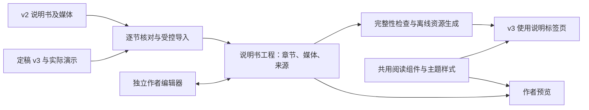

# PhoneticToolbox v3 图文音频说明书与独立作者编辑器规划

**日期：** 2026-10-04，2026-10-05 按井井追加要求更新  
**任务：** P10-MANUAL，归属总计划 P10 的说明书重编排，与 P04 公共工作台、P19 外观及 M01–M17 联动。  
**状态：** in_progress。井井于 2026-10-05 明确要求没有问题直接执行，已启动阅读器、独立编辑器及模块 README 三条实施线。  
**冻结边界：** 井井于2026-10-05确认感知实验M15已定稿，纳入正文和截图；生理参数合成M10章节暂空，不纳入本轮正文验收。所有截图须先将实际应用最大化，再采集全窗口图或从其裁切。每个模块独立章节代理，当前同时不超过三位子代理。

### 2026-10-05 追加执行约束

| 用途 | 指定材料与边界 |
| --- | --- |
| EGG 演示 | `C:/Users/13680/Desktop/project/音频数据/EGG测试/3.wav`；只读源文件，正式分析前核实音频/EGG 声道角色 |
| 一般语音与标注演示 | `C:/Users/13680/Desktop/project/音频数据/线下录音/男1`；使用已存在的 WAV、LAB、TextGrid，保留原目录与内容 |
| 单音节操控与合成 | `C:/Users/13680/Desktop/project/音频数据/test`；用于变速变调、发声类型合成、声学参数合成等，历史结果与新输出分开 |
| 感知实验刺激 | 合成或自然音频均可；M15 定稿后核验实际运行流程 |
| 自然音频分发 | 井井已允许随软件分发及展示处理结果，明确禁止上传公开 GitHub；素材和私有来源记录放受忽略目录，公共文档不写私人绝对路径 |
| 唇形视频 | 暂空，井井以后录制；保留可编辑示例插入位置，不用虚构同步视频补位 |
| 生理参数合成 | 当前 M10，原声道工作台；仅保留章名与稳定 ID，正文、截图和演示暂空 |
| 子代理 | 所有写作、编辑器与审校子代理统一 `gpt-6.1-sol`，`reasoning_effort=xhigh`，不调用 Astra；同样约束后续代理 |
| README | 每个模块一份统一格式 README，加根总 README 和作者工具 README；为后续 GitHub 同步准备，本次指令不等于立刻 push |

指定路径存在性已核对。仅文件头/目录清单核查：`3.wav` 为约 77.249 秒、44.1 kHz、双声道 32-bit float；男1 目录直接含 63 WAV、63 LAB、93 TextGrid；test 目录直接含 31 WAV 和相应结果文件。这些检查不代表声道角色、标注质量或人耳听辨已经验收。

**Goal：** 以 v2 说明书为底稿、以定稿后的 v3 实际行为为操作依据，交付应用内可定位章节的完整说明书，以及只供作者使用、独立于产品的可视化编辑工具。

**Architecture：** 采用一份结构化内容源、一个共用阅读渲染层、两个独立入口。v3 应用只集成阅读页；作者工具独立运行并保存章节与素材，生成离线阅读资源后纳入 v3 构建。章节、图表、音频和交叉引用使用稳定标识，显示编号可以随编排变化。

**Tech Stack：** 阅读端沿用 Vue 3、TypeScript、现有主题及字体机制。作者端建议采用 Vue 3 与 Tiptap/ProseMirror，配本地文件保存适配器；内容采用带版本的 JSON 和独立媒体文件。新增依赖的具体版本、锁文件与许可清单在实施前冻结，本轮不安装。

## 1. 本轮核查与设计依据

### 1.1 已核查的本地材料

| 材料 | 本轮事实 | 对规划的影响 |
| --- | --- | --- |
| `D:/PhoneticToolbox/PhoneticToolbox_v2/Phonetic_Export/index.html` | 完整阅读版正文，16 个一级章节、57 个二级小节、161 处图片节点、24 处音频节点、16 张 HTML 表格 | 以此为内容底稿，后续逐节核对，不能只迁移标题 |
| 同目录 `images/`、`audios/` | 163 个图片文件、23 个 WAV 文件，合计 13,389,859 字节；正文 184 个去重后的本地媒体引用均存在 | 建立引用与素材清单，区分引用次数和文件数，保留额外素材，不在迁移时自动清理 |
| 23 个 WAV 文件头 | 均可读取，采样率为 16,000 或 44,100 Hz，均为单声道，时长约 0.485–2.000 秒 | 文件可读取不等于已听辨、来源已核实或适用于所有模块 |
| `PhoneticToolboxDoc.html` | 原作者编辑器，采用文本编辑与预览、章节管理、图片/音频导入、网页包导入导出；正文和媒体曾存于 localStorage；JSZip、KaTeX 从 CDN 加载 | 可以借鉴原工作习惯；新版本需完整富文本操作、可靠磁盘保存和离线运行 |
| `PhoneticDoc_网页导入包_v2.2.0.zip` | 可只读枚举，187 个归档条目，含 `index.html` | 作为迁移对照；尚未导入或证明与当前散文件完全一致 |
| [v3 当前帮助页](../../frontend/src/app/HelpPage.vue) | 简短说明直接写在 Vue 模板中，没有完整章节系统 | 需要将内容与应用代码分离 |
| [模块注册表](../../frontend/src/app/registry.ts) | 当前为 17 模块，已有三组顺序及最新名称 | 目录按当前显示顺序组织，保留 M01–M17 标识 |
| 各模块帮助入口 | 当前存在内联展开、弹窗和帮助与来源混合入口 | 统一到说明书定位接口，同时保留独立的方法与引用功能 |
| [主题变量](../../frontend/src/design/tokens.css)、[应用外壳](../../frontend/src/app/AppShell.vue) | 已有共享色彩变量、深浅模式、标签页与用户字体机制 | 阅读页直接继承，不引入独立主题系统 |
| [既有说明文档](../manual/)、[v2 覆盖表](../modules/v2-manual-coverage.md)、模块报告 | 已有模块操作说明和历史差异记录 | 作为核对线索，最终仍逐项回到定稿代码与实际页面 |

本轮正文 SHA-256：`a46c984929bcd8073ff1daf4e6b382a6685d4ca19e0fee0e29de3ecf0fb39ad5`。编辑器 SHA-256：`734cc180d7c190457d8244db13742d0f423a2768fbc1e01bfcf93ed100214651`。

### 1.2 已发现的迁移重点

1. **v2 音频包含合成与重建示例。** 第 4 章含合成元音及旧发声态预设，第 5 章含变速变调结果，第 9 章含语谱重建结果。不能把这些文件统一标为自然人声，也不能把旧算法结果标成 v3 输出。
2. **现帮助页存在过时描述。** 例如仍写参数估计 240 秒预算和参数图旧拖动手势，近期 M01-R4、M02-R2 已有相应变更。具体数值和控件名必须随定稿版本复核。
3. **旧说明书不覆盖全部新模块。** 录音、国际音标表Plus 需要基于 v3 现有实现补写独立章节；参数估计和参数显示需要拆为两章。
4. **软件仍在变化。** 目前不能把某次源码截图当成最终手册截图。先冻结行为与界面，再执行演示、截图和文字校对。
5. **不能通过说明书任务顺手修科学行为。** 文档与产品不一致时建立差异项。允许本任务实现帮助入口、阅读页和作者工具；算法、输出格式或模块功能变更另按原任务处理。

## 2. 交付形态与技术选择

### 2.1 推荐方案

**独立作者编辑器 + 应用内阅读器 + 同一份说明书工程。**



应用内部只装入阅读所需的内容、播放器、图片查看和导航组件。编辑器有独立构建、入口和依赖，不用隐藏按钮、特殊密码或作者开关混在正式应用中。阅读端构建依赖图和成品文件清单必须证明没有带入编辑器。

作者工具暂定名为 **PhoneticDoc Studio**，提供中文界面和 Windows 双击启动入口。可以在独立浏览器窗口中编辑，启动器负责运行本地工具、保存工程和预览，不要求作者手工运行命令。

这是一项独立作者工具，不是给 v3 每个页面增设服务。产品阅读页继续使用现有统一宿主；作者工具的本地写文件服务只随作者启动器运行，并仅访问打开的说明书工程。

### 2.2 与其他路径的比较

| 方案 | 优点 | 主要不足 | 决策建议 |
| --- | --- | --- | --- |
| 独立富文本作者工具，共用阅读层 | 图音表格操作直观，预览一致，章节与素材可校验 | 首轮需要内容模型和编辑工具开发 | 推荐，符合长期编辑要求 |
| 在旧 PhoneticDoc 上继续扩展 | 熟悉原入口，旧内容导入接近现有形式 | 当前偏文本编辑，复杂表格、排版、可靠保存仍需大改 | 借鉴交互和导入逻辑，避免直接照搬为最终架构 |
| 直接编辑 Markdown/HTML 文件 | 工具链简单，便于代码审阅 | 合并单元格、图音布局、格式调整容易要求手写标签 | 作为导入导出能力，不能作为唯一编辑方式 |

Tiptap 官方提供 JSON 持久化、自定义内容节点及表格编辑能力，适合做本方案的基础；图注、音频比较、引用、工程保存和构建流程仍需项目自行实现。[持久化文档](https://tiptap.dev/docs/editor/core-concepts/persistence)、[自定义节点](https://tiptap.dev/docs/editor/extensions/custom-extensions/node-views)、[表格文档](https://tiptap.dev/docs/editor/extensions/nodes/table)。仓库核心采用 [MIT 许可](https://raw.githubusercontent.com/ueberdosis/tiptap/main/LICENSE.md)，这不自动覆盖所有增值扩展。实施只选已核实许可的开源组件，不依赖付费云服务；具体依赖以锁定清单为准。

### 2.3 内容工程与阅读产物

建议新增以下结构，路径均为规划，当前不创建：

```text
manual/
  manifest.json                  书名、版本、适用软件版本、章节顺序
  chapters/<stable-id>.json       每章独立的结构化内容
  assets/images/                 实际截图、图解及原图
  assets/audio/                  经核实的输入及实际演示输出
  assets/examples/               随例参数、TextGrid、可分享的示例文件
  media-manifest.json            类型、来源、哈希、图注、派生关系
  examples-manifest.json         实际演示的输入、设置、版本和输出对应
  references.json                正文引用与既有来源注册表的关联
  help-targets.json               模块/功能到章节与小节的映射
  coverage.json                  逐项操作覆盖与核验记录
tools/manual-studio/             独立作者工具及其锁定依赖
frontend/src/manual/             共用只读渲染、导航和主题样式
frontend/public/manual/          生成的离线阅读资源，不作为手工编辑源
scripts/manual/                 导入、验证、编译、差异报告
```

内容格式建议命名为 `ptb-manual/1`。每章有 `chapterId`，每个标题、图、表、音频和引用有稳定 ID，编号由生成器计算。M01 等模块键不受章节排序影响。schema 版本不兼容时给出清楚错误，后续格式升级通过显式转换并保留旧工程，不静默改写。

权威编辑源为 `manual/`。现有 `docs/manual/*.md` 继续保留，实施时将其转换为生成的纯文本副本或带明确入口的开发说明，逐份说明角色，避免形成两套互相漂移的操作正文。Markdown/HTML 导出可读；复杂布局的完整无损往返以原生工程格式为准。

## 3. 应用内阅读页

### 3.1 页面布局

直接改造井井截图中的“使用说明”标签页正文区。现有软件总侧栏保留，在该标签页内部增加说明书目录。

```text
应用现有侧栏 │ 使用说明标签页
             │ ┌────────────────┬─────────────────────────────┐
             │ │ 搜索说明书      │ 面包屑 · 返回工具 · 阅读进度 │
             │ │ 入门与公共操作  │ 章节标题、简介、当前小节     │
             │ │ 01 录音        │ 步骤、截图、图注、表格       │
             │ │   1.1 准备工程 │ 音频播放器、示例和引用       │
             │ │   1.2 设备选择 │                             │
             │ │ …              │ 上一章 / 下一章             │
             │ └────────────────┴─────────────────────────────┘
```

这是结构示意，不是已经实现的页面或截图。实施阶段先用一章样板展示真实页面，确定后再批量铺开。

建议目录初始宽度约 250 px，可拖动和记忆；正文采用适合长文阅读的行长，常规文字区域约 760–980 px，图片和宽表可适当放宽。窄窗口收起为目录抽屉，不让两列挤成细长正文。数字属于待样板验证的设计初值。

### 3.2 导航规则

| 触发方式 | 预期行为 |
| --- | --- |
| 点击全局“使用说明” | 复用唯一说明书标签页；首次打开进入导读，以后恢复上次位置；始终可返回总目录 |
| 点击模块“帮助/使用说明” | 激活说明书，进入对应模块章首或当前功能小节，短暂突出目标标题 |
| 点击目录小节 | 展开所在章，加载内容并定位，目录同步选中 |
| 滚动正文 | 目录跟随当前小节，避免程序滚动与用户滚动反复抢位置 |
| 全文搜索 | 离线检索标题、正文、图表注和控件名，展示命中上下文，点击定位到具体内容 |
| 点击正文交叉引用 | 跳转对应章、小节、图表或音频，支持返回原位置 |
| 点击“返回工具” | 回到发起帮助的标签页，保留当时文件、草稿、参数与选区 |
| 删除或重命名小节 | 改名保持原 ID；删除前显示受影响入口，要求作者重新指向，不能悄悄失效 |

新增统一内部接口，概念上为 `openHelp({ moduleId, sectionId })`。不将中文标题或章节数字作为唯一地址。不直接改写现有工作台 `location.hash` 规则，避免与 `#M01` 等启动入口冲突。

跨章跳转先完成加载、字体与目标布局，再定位；图片预留尺寸，避免加载后把目标顶走。快速连续点击时仅执行最新定位请求。失效链接回到该章并显示提示，构建时将内部断链列为错误。

M10 等嵌入文档页通过已有宿主边界转发帮助事件，校验事件来源和受支持的目标。帮助与方法引用分工明确：操作入口到说明书，方法入口仍可查看来源，并与本章参考文献互链。

### 3.3 阅读、播放与主题

- 正文、表格、提示框、链接、代码背景和播放器继承 `--panel`、`--text`、`--muted`、`--border`、`--accent` 等现有语义变量，切主题立即更新。
- 继承中英文字体、字号和代码字体；IPA 按项目规范使用固定 Doulos SIL，保留组合字符与上下标。
- 所有截图配图注、替代文字、放大查看；截图保持实际色彩。主题切换时不反相处理科研截图。关键概览可准备浅深两版，普通操作图允许保持一个清晰的固定主题版本。
- 默认采用语义强调色。作者可以指定文字颜色及浅深两套值，编辑器提供对比度提示和恢复主题色，不限制正文编辑权限。
- 音频不自动播放，显示名称、用途、来源类型、时长、采样率及声道说明。提供播放/暂停、进度与原始文件保存能力。
- 同时只播放一段说明书音频，跨标签切换及时停止；与现有模块播放控制协调。录音采集或正式实验运行期间不允许示例音频意外混入，遵循已有运行状态保护，不因打开帮助取消任务或丢掉工程。
- 图片按需加载，音频默认不预读整段内容；章节按需渲染，目录和搜索索引独立加载，避免把全书大图一次塞入页面。
- 表格在自身容器内横向滚动，代码块可复制，章节标题支持键盘定位。阅读页整体不出现无意义横向滚动。

## 4. 全书目录与逐章范围

展示顺序跟随当前三组模块顺序，编号仅服务阅读。共 **17 个模块独立章节**，另有公共导读、设置维护和附录。下表列出各章特有内容，所有章还须满足第 5 节的统一结构。

| 阅读章 | 模块与 v2 来源 | 拟写小节与重点 |
| --- | --- | --- |
| 导读 | v2 第 1 章、v3 公共工作台 | 安装/启动的实际适用范围；首页与三组工具；标签页及草稿；侧栏尺寸；文件选择与关联；波形/语谱和时间单位；选区/缩放/平移/播放；任务与导出；怎样使用目录、搜索和示例 |
| 01 录音 | M16，v3 新章 | 1.1 工程建立与保存；1.2 输入输出设备、物理通道和音频/EGG 角色；1.3 录前检测与削波；1.4 自由录音；1.5 任务录音、CSV/TSV/XLSX 清单及模板；1.6 版本重录与试听；1.7 选区、剪辑、撤销、降噪；1.8 波形与 Praat 语谱；1.9 单条/批量 WAV 导出；1.10 工程恢复和设备问题 |
| 02 唇形提取 | M05，v2 7.1–7.4、13.4 | 2.1 相机/麦克风和采集准备；2.2 实时预览；2.3 实时录制；2.4 高帧率先录后算；2.5 完整帧回放、面部与四曲线；2.6 低通与质量判断；2.7 音频/唇形偏移检查；2.8 视频/动画/音频/唇形保存组合；2.9 旧新格式及下游关联；2.10 方法差异和同步限制 |
| 03 参数估计 | M01，v2 2.1 | 3.1 文件夹、递归与列表；3.2 声道和试听；3.3 TextGrid 关联与层选择；3.4 旧 PKL/新唇形文件及逐条关联；3.5 参数选择与所有设置；3.6 REAPER/Praat 等 F0 设置；3.7 音频/EGG 联合分析与互换角色；3.8 长音频、分段与进度；3.9 批处理、取消、失败恢复；3.10 XLSX/SQLite 保存与同名规则；3.11 TextGrid 音频/参数同源切分；3.12 完整示例及结果解释 |
| 04 参数显示 | M02，v2 2.2 | 4.1 WAV 与结果关联；4.2 XLSX/SQLite 与大表读取；4.3 参数搜索筛选和多选；4.4 新建/清空/删除/合并图窗；4.5 单双纵轴与量纲；4.6 波形、标注、语谱和参数时间对齐；4.7 选区、Shift 平移和缩放；4.8 整幅/单图 PNG、SVG、尺寸与字体；4.9 缺失值和来源解释 |
| 05 EGG 信号分析 | M03，v2 3.1–3.4 | 5.1 双声道输入及音频/EGG 判别；5.2 四图与全段总览；5.3 宏观选区及微观时间窗；5.4 高低通与设置；5.5 GCI/GOI、CQ/SQ 等指标；5.6 Praat/REAPER F0 和显示；5.7 逆滤波布局、自动/手动 dB 及边界；5.8 单文件导图/CSV/WAV；5.9 批处理；5.10 真实例图、常见失败及解释限制 |
| 06 LPC 谱图 | M04，v2 第 11 章 | 6.1 输入与 TextGrid；6.2 分析选区/可见窗；6.3 阶数、窗长、预加重及频率设置；6.4 谱图与波形；6.5 固定/动态纵轴；6.6 播放、历史片段；6.7 当前图与完整结果保存；6.8 阶数比较与谱包络解释 |
| 07 声学参数合成 | M06，v2 4.1–4.5 | 7.1 布局与合成时长；7.2 F0/共振峰等曲线编辑；7.3 元音生成语法、顺序和边界；7.4 AV/AH 与发声态预设；7.5 渐入渐出及试听；7.6 手动提取与复制合成；7.7 Klatt 设置与历史格式兼容；7.8 参数、声音、来源等保存文件；7.9 真实运行输出对比及旧版本变化。已移除的 WORLD/PSOLA 不写成现行功能 |
| 08 生理参数合成 | M10，v2 第 15 章为历史参考 | 井井要求暂空，仅保留稳定章节入口；不采集本轮最终截图，不填写旧操作正文，待大改后另行补写 |
| 09 发声类型合成 | M07，v2 14.1–14.4 | 9.1 源/目标音频；9.2 分别选区与试听；9.3 F0 提取；9.4 残差和声道参数；9.5 仅 F0、仅发声类型、同时改变三种模式；9.6 连续统级数、能量匹配；9.7 单个/批量生成；9.8 保存与命名；9.9 端点/中点听辨及方法限制 |
| 10 变速变调 | M08，v2 5.1–5.4 | 10.1 输入与提取；10.2 选区与显示窗；10.3 手绘 F0、拐点与插值；10.4 速度和基频变换；10.5 原音/结果/历史直接试听；10.6 历史对比与恢复；10.7 批量生成各模式；10.8 批量保存与同名保护；10.9 前后音频和曲线对照 |
| 11 语谱图转音频 | M09，v2 9.1–9.2 | 11.1 图片导入与主动截图；11.2 四角选取/校正；11.3 时间、频率及灰度标定；11.4 窗长、迭代和种子；11.5 重建与进度；11.6 试听、校正图和结果谱；11.7 WAV/PNG/来源文件；11.8 从已知真实音频制谱再重建的例子；11.9 相位缺失和近似重建边界 |
| 12 国际音标表Plus | M17，v3 新章 | 12.1 IPA/extIPA/VoQS；12.2 名称、搜索与悬浮介绍；12.3 插入、替换选区和光标；12.4 附加符号、组合顺序与字体；12.5 草稿、撤销、复制与导出；12.6 复杂 IPA 输入示例；12.7 中文译名、例示与来源 |
| 13 汉字转国际音标 | M13，v2 10.1–10.2 | 13.1 输入和转换；13.2 不同转写体系；13.3 多音字选择；13.4 声调和显示设置；13.5 批量文本/表格处理；13.6 复制/下载与草稿；13.7 转写示例；13.8 词典与音系解释限制 |
| 14 MFA 自动标注 | M11，v2 8.1–8.3 | 14.1 实际运行条件与组件；14.2 同名音频/文本/TextGrid；14.3 声学模型与词典匹配；14.4 层名、编码和预检；14.5 参数与启动；14.6 进度、取消和错误处理；14.7 TextGrid 与日志；14.8 转入 TextGrid标注复核；14.9 未登录/平台能力及资源限制按实际版本说明 |
| 15 TextGrid标注 | M12，v2 13.1–13.6 | 15.1 语料与层；15.2 波形/语谱/强度视图；15.3 边界新增、移动、合并及撤销；15.4 文本、音标和快捷键；15.5 词典与层名；15.6 参考 TextGrid 复用；15.7 强度贴合及序列操作；15.8 唇形显示与偏移；15.9 保存、自动保存和命名；15.10 长录音和异常恢复 |
| 16 音系归纳 | M14，v2 12.1–12.2 | 16.1 调查字表准备；16.2 列映射与导入；16.3 IPA 解析与修正；16.4 声母、韵母、声调归纳；16.5 排序筛选和同音字表；16.6 导出；16.7 缺失/异常符号处理；16.8 人工复核与学术判断边界 |
| 17 感知实验 | M15，v2 6.1–6.2 | 17.1 X/AX/ABX/AXB；17.2 真实声音/图文刺激材料；17.3 序列、随机化与种子；17.4 指导语、问卷和响应键；17.5 时间、推进和播放设置；17.6 预检与试运行；17.7 正式运行、暂停中断及恢复；17.8 数据字段、反应时和导出；17.9 工程跨设备准备；17.10 计时及外设边界 |
| 设置与维护 | 既有 settings 等文档 | 外观主题/深浅模式；字体和图表字体；按钮、波形与时间显示；本机草稿和文件保存；桌面/网页差异；帮助、引用与版本信息；常见问题 |
| 附录 | 统一生成与校对 | 参数词典；默认值/单位；快捷键速查；文件格式及命名；完整示例索引；术语表；参考文献；v2→v3 对照；手册更新记录 |

上述小节是覆盖框架，不提前承诺某个待改功能已经实现。正式编号、名称和功能范围在冻结矩阵中核定。未来计划单独放更新记录，不混入操作步骤。

## 5. 每章统一写法与完整性标准

### 5.1 统一章节骨架

每章按以下逻辑展开，可以增加专用小节，不能机械删减关键内容：

1. 本章能完成什么，适合什么材料，有什么前提。
2. 输入准备：格式、目录、同名关系、通道、单位、上限、可选材料。
3. 界面导览：一张实际总览图，编号标注区域与对应表。
4. 从打开文件到保存结果的一次完整操作。
5. 各功能的详细操作：所有按钮、设置、手势、快捷键和可用条件。
6. 参数说明表：界面名称、含义、默认值、单位、范围、作用时机、相互影响。
7. 真实演示：输入、设置、步骤、实际结果、图片/音频及解读。
8. 保存与恢复：文件内容、位置、命名、冲突、取消、失败和重开行为。
9. 常见问题：可见症状、原因判断、处理步骤及成功后的表现。
10. 方法与引用：算法、实现来源、版本、材料出处和可解释边界。

每个操作单元回答：**在哪里操作、操作前需要什么、具体怎么做、什么会改变、如何确认成功、异常时如何恢复。** 不以“调整合适的参数”“按需保存”等空泛表述代替说明。

### 5.2 控件覆盖矩阵

每个模块建立“v2 段落/功能 → 定稿 v3 控件与代码 → 新小节 → 示例/截图 → 核验记录”映射。覆盖按钮、菜单、输入框、滑块、勾选、右键、双击、修饰键手势和键盘快捷键。

每个项目具有 `itemId`、`moduleId`、源材料定位、当前页面入口、适用状态、章节锚点、证据和核验结果。每个实际可达操作都必须有正文或明确的公共说明交叉引用。没有对应材料时记录缺口，不能通过补一个空标题使覆盖计数通过。

公共操作集中讲一次，各章写出自身差异并链接到公共说明。例如拖动是选区还是平移、试听对应哪条音频、单次处理还是全列表处理，都按模块核对。

### 5.3 全书风格规范

| 项目 | 统一规则 |
| --- | --- |
| 语气 | 中文专业操作说明，直接称读者为“你”或省略主语；不加入角色称呼和颜文字 |
| 标题 | 章/节/小节三层优先，动宾结构为主，避免多章采用不同命名模式 |
| 控件 | 正文加粗真实界面名称，拼写、空格与标点以定稿界面为准 |
| 步骤 | 一步一个主要动作，写出必要反馈，复杂条件另列说明 |
| 数值 | 明确单位和适用算法；默认值从冻结配置核对，当前用户值与默认值区分 |
| 术语 | 同一个概念采用同一译名，首次出现补英文或缩写释义；保留确有差异的构念 |
| 代码 | 统一等宽字体、语言标签、复制按钮；示例必须可复核，禁用真实用户名和私有绝对路径 |
| 图表 | 统一图题、表题、编号、图注、来源与正文引用方式 |
| 提示 | 固定为操作提示、条件说明、结果解释、限制四类，继承主题语义颜色 |
| 引用 | 正文统一作者—年份形式并可点击；参考文献统一字段和顺序，代码/数据/论文分别标注 |
| 跨平台 | 已核验平台写明确；未验证能力不依据界面存在推断可用 |

## 6. 截图、音频、示例与表格

### 6.1 截图流程

1. 将实际 v3 应用最大化，确认最大化状态，记录目标软件版本、模块文件哈希、主题、实际窗口逻辑尺寸、系统缩放和材料 ID；统一截图基准，不用未最大化窗口补齐正文图。
2. 在最大化的实际 v3 页面完成步骤，捕获全窗口原图、总览、重要设置、关键结果和必要错误状态；局部图从同一全窗口原图裁切。
3. 保存原图，另建用于排版的裁切/编号版本；仅作裁切和指示标记，不伪造按钮、曲线或数值。
4. 图注写清界面状态、观察重点、输入/选区和必要参数。正文通过稳定图 ID 引用。
5. 复核文字清晰度、标尺、单位、IPA、个人信息与最终布局。

核心操作截图以实际 Windows Qt 应用为主要证据。Chrome 可用于补充自动化与网页说明；两种宿主差异单独标注。不会把浏览器模拟 DPI 当成实体高 DPI 实测。

建议多数模块以 5–10 张有效截图为起点，复杂模块按功能增加。全书先按约 100–160 张图片规划素材管理能力，数量不作为完成标准，最终由操作覆盖决定。

### 6.2 图注与表格

图注至少包含：图号、简洁标题、正在展示的步骤/状态、读者应注意什么。涉及结果时补充输入编号和关键参数；引用旧图、外部图或论文图时写明来源和版本。

表格优先用于参数、快捷键、格式、输出文件、模式差异、保存组合和常见问题。表题置上、说明置下，提供表头，宽表可滚动。80 项参数等长表可按类别分节，搜索仍覆盖全部内容。

图号、表号、音频编号按章自动维护。插图或拖动排序后，正文引用随之更新；作者仍可编辑标题、说明和展示样式。

### 6.3 音频真实性与复现

“真实音频”在本任务中的实施要求为：**每个播放器必须对应一个实际存在、可以播放、有来源的文件；用于说明 v3 行为的处理结果必须由目标 v3 实际生成。** 文件类型必须分别标为自然录音、合成声音、重建声音或处理结果。

- 优先检查井井已指定的 v2 说明书素材。它们可以用于已说明来源的旧例，也可作为合适的输入，但旧合成声音不标为真人录音。
- 参数估计、EGG、LPC、标注和自然复制合成等需要合适的自然录音。v2 说明书素材不足时，先列出缺口及所需的具体文件类型，再由井井指定补充材料；不查找无关论文或私人语料目录。
- EGG 示范需要可确认的同步音频/EGG 材料，普通单声道语音不冒充 EGG。唇形采集示范需要相应视频/同步材料。
- 合成、变调、声道和谱图重建章节展示实际输出，明确参数与方法；原声/结果成对排列，便于听辨。
- 对比材料记录是否统一监听音量。默认保留原输出；确需生成监听增益版本时另存、标注处理方式，不隐藏可能有研究意义的幅度差异。
- 不用 TTS、任意正弦波或未运行的预期音频充当自然语料证据，不把算法名称自动当成听感或生理结论。

每份演示记录：输入/输出 SHA-256、材料来源、可使用范围、采样率、声道角色、时长、片段范围、全部设置、软件与计算版本、生成时间、结果文件及对应章节。首次正式纳入时完成播放检查，并记录是否经过人耳听辨；仅解码成功不能写成听感验收通过。

旧材料的使用授权、自然/合成属性和公开再分发权限分开记录。来源未明确的材料可以保留为作者本地待核实素材，不自动进入可公开分发的说明书包，也不阻塞无关章节推进。本任务不包含对外发信和公开发布。

### 6.4 建议演示链

| 演示链 | 覆盖模块 | 必要材料与展示 |
| --- | --- | --- |
| 自然短句分析与标注 | M01、M02、M04、M11、M12 | 一份适合的真实短句、文本、TextGrid；展示从输入到测量和修订的全过程 |
| 音频/EGG 联合分析 | M01、M03 | 具有明确通道角色的同步录音；显示宏观、微观和实际导出 |
| 音高与发声操控 | M06、M07、M08 | 经核实的输入/端点，实际生成的对照音频、曲线和保存参数 |
| 语谱重建 | M09 | 从已知音频取得谱图，记录绘图与标定条件，再实际重建并比较 |
| 唇形采集与对齐 | M05、M12、M02 | 同步视频/音频/唇形材料，展示偏移检查和下游读取 |
| 录音与感知 | M16、M15 | 实际录音或明确来源的刺激，任务模板、试次配置与真实导出结果 |
| IPA 与音系整理 | M17、M13、M14 | 可分享的例词/调查字表，完整 IPA 码位与人工校对说明 |
| 声道过渡 | M10 | 保存的构形/帧序列、实际合成音频和必要视频，不称为某个真人的实测发音 |

## 7. 作者编辑器的完整权限

### 7.1 必需功能

| 能力 | 首版验收范围 |
| --- | --- |
| 章节管理 | 新建、改名、移动、排序、复制、删除、拆分/合并小节；目录实时更新；稳定 ID 与重定向提示 |
| 基础文字 | 输入/粘贴、加粗、斜体、下划线、删除线、上下标、字号、字体、颜色、背景强调、清除格式 |
| 段落与布局 | 标题、缩进、行距、段前段后、左中右/两端对齐、有序/无序列表、分隔线、引用、提示框、单栏/双栏、图文并排及窄窗堆叠 |
| 图片 | 文件选择、拖入/粘贴、替换、尺寸/对齐、并排、原图与裁切视图、图注、替代文字、来源字段、放大预览 |
| 音频 | 插入/替换文件、播放器预览、标题/说明、来源类型、原音/结果比较组、元数据读取、下载入口；音频处理由目标模块完成 |
| 表格 | 新建、增删行列、合并/拆分单元格、表头、列宽、对齐、文字格式、主题底色、表题与表注 |
| 专业内容 | 行内代码/代码块、语言选择、数学公式、IPA 专用文字样式、链接、内部交叉引用、参考文献、脚注 |
| 编辑效率 | 撤销/重做、查找替换、快捷键、块移动、章节草稿、素材库和引用位置查询 |
| 作者预览 | 共用正式阅读组件；浅深色与主题预览；窗口宽度预览；正文/目录/图音表格/跳转与实际阅读一致 |
| 工程管理 | 打开/新建、Ctrl+S、磁盘自动保存、另存副本、变更记录、崩溃恢复、完整工程包导入导出、本地阅读资源生成 |

所有正文内容均可编辑，图注、引用、参数解释和布局也不锁定。统一风格通过默认样式和检查提示实现，作者可以有意识地覆盖默认样式。

“完整编辑权限”指内容与排版操作。说明书阅读内容不执行任意脚本，不加载带本机写权限的 HTML。导入旧 HTML 时解析为受支持的内容节点；不支持的结构明确列出，保留原材料并由作者处理，不能静默丢失。高级内容可查看结构化源码，格式验证通过后再应用。

### 7.2 保存与内容安全

工程落盘是正式保存，浏览器缓存只用于临时恢复。编辑器显示已保存/保存中/失败与最后保存时间。

保存流程校验 schema 和资源，写入暂存文件，再原子替换对应章节。写入权限失败、磁盘不足或文件被占用时保留编辑状态和上次完整版本，提供另存。多个编辑实例采用工程锁或内容哈希冲突提示，不后写覆盖前写。

媒体导入时复制到工程素材目录，以稳定 ID 或哈希引用，移动原始文件后仍能显示。粘贴图片同样成为独立素材文件，不把大批音频/图片塞进 localStorage 或一个巨大 JSON。

历史版本和自动恢复文件由作者工具管理，默认不自动清理既有工程或 v2 文件。删除正文块、删除章节和清理未引用的物理媒体分开操作，后者必须由作者明确执行。

本地文件接口只开放说明书工程内必要操作，检查路径边界和会话来源。归档导入检查路径穿越、重复目标和解压体积，不执行 zip 中的脚本。资源与引用文件格式均有版本标记。

### 7.3 井井日后编辑的完整流程

1. 双击作者工具，打开该说明书工程。
2. 在左侧选择章节，直接修改正文，插入图片、音频、表格或调整排版。
3. 在右侧预览正式阅读效果，切换主题或窄窗检查。
4. 保存工程；运行检查，看到断链、缺图注、未核实媒体等具体位置。
5. 点击“生成本地阅读版”，得到与源工程分开的版本化只读资源。
6. 开发态 v3 载入生成资源核对；正式 EXE 更新时由正常构建带入该版本。

修改工程不会直接改变已经分发的 EXE。首版不增加在线手册更新服务、账号或远程管理后台。是否后续需要脱离 EXE 更新的只读资源包，可独立讨论，不提前扩大本轮架构。

## 8. 定稿、协作与统一风格

### 8.1 冻结与变更控制

实施开始时建立逐模块冻结表，记录版本/本地源码哈希、界面名称、默认值、输入输出、手势、预算及已知限制。现有工作区有同期改动，不能只记 Git HEAD 代表全部实际内容，也不要求为写手册覆盖或清理它们。

一个模块具备“界面与行为可用于手册”的确认后，才进入该章正式写作与截图。若井井选择等全部模块完成再开动，就统一冻结后启动。

之后有功能改动，按模块标记受影响段落、图、音频与默认值。增量复核对应章节，不无故重写全书。手册版本与适用软件版本分开记录，保留变更说明。

### 8.2 子代理组织

2026-10-05 已获开始指令，采用 **秋叶总编 + 最多三名并行子代理**，按现有并发容量滚动分配。所有子代理统一 `gpt-6.1-sol` / `xhigh`，包括写作、编辑器与交叉审校。首次并行拆为阅读器、独立编辑器、模块 README；组件完成后滚动转入逐章写作。章节代理只操作分配的章节、素材清单和证据文件，不同时修改共享应用外壳、目录注册表或公共主题。

建议分组：

| 分组 | 章节范围 | 专项关注 |
| --- | --- | --- |
| A 分析与采集 | M16、M05、M01、M02、M03、M04 | 通道、关联、测量设置、同步与数值解释 |
| B 合成与操控 | M06、M07、M08、M09，M10 仅保留空入口 | 实际输入输出、听辨对照、算法版本和近似边界 |
| C 标注与实验 | M17、M13、M11、M12、M14、M15 | 符号、文本、层级、材料准备和实验流程 |

任务按章交付，分组不代表一次写完六章才审阅。每次提交包含正文、控件覆盖、图表/音频清单、实际示例记录、来源、未决项。共用同一份模板、术语表、组件库与编号规则。

先由主线完成 **M08 变速变调样板章**，因为它同时涵盖图窗、手绘、历史、音频比较和保存。若冻结时 M08 仍在改动，则选择已经定稿且覆盖这些媒体需求的章节替换。样板通过阅读与编辑往返验收后，交由井井审阅排版，再铺开其他章节。

截图和音频采集使用独立、归属明确的测试实例与目录。需要真实硬件的采集由单一执行者顺序进行，多个代理不争用相机、麦克风或同一个 GUI 实例。不得从别的聊天自行获得额外操作授权。

### 8.3 审校层次

1. 章节作者自查：每条操作与实际控件、参数和输出一致。
2. 交叉审校：另一位代理按文中步骤重走，核对遗漏与歧义。
3. 总编统一：术语、句式、编号、代码格式、图注、引用及主题样式。
4. 媒体审校：图与正文、音频与设置、表格与实际输出一致。
5. 作者试改：井井完成一次插图、插音频、改表格与重排，再回到 v3 阅读确认。

## 9. 分阶段实施与每阶段退出条件

| 阶段 | 工作与顺序 | 交付物 | 退出条件 |
| --- | --- | --- | --- |
| S0 初始规划 | 只读核查、架构比较、章节目录、素材/编辑/验收设计 | 本文 | 已完成规划；2026-10-05 追加启动授权 |
| S1 冻结与盘点 | 明确开始指令；登记各模块版本；全文盘点 v2；对照 v3 控件；核实素材及缺口 | 冻结矩阵、功能覆盖初表、素材/来源清单 | 每章范围有依据，素材缺口和可独立推进部分明确 |
| S2 内容格式与阅读基础 | 先定义 schema、稳定 ID、主题样式和跳转；接入空目录和测试内容；验证现有标签状态不丢失 | 共用阅读层与导航接口 | 样例图音表格可离线阅读，定位与主题通过 |
| S3 独立编辑器 | 建章节管理、富文本/图音表格、磁盘保存、导入导出、共用预览和生成器 | 作者工具及双击入口 | 修改→保存→重开→生成→阅读往返通过，未知内容不静默丢失 |
| S4 样板章 | 核对 M08；用真实文件完成实际演示；截图、音频、表格、来源；作者编辑试验 | 完整样板章和检查记录 | 内容与界面核验通过，井井认可排版和编辑体验 |
| S5 逐章写作 | 按三组滚动分配；每章按核查→演示→截图→写作→交叉校对顺序 | 17 章正文、公共章与附录 | 操作覆盖闭合，真实媒体及来源可追溯，待办不伪装成完成 |
| S6 全部入口接线 | 统一模块帮助按钮和细功能入口，处理 M10 嵌入页，维护别名和返回状态 | 全部帮助入口映射 | 17 模块逐一打开正确章节，特殊运行状态不受损 |
| S7 联合验收与交付 | 全书内容检查、Qt/Chrome 实页、主题/尺寸/离线、编辑恢复、打包边界审计 | 说明书工程、作者工具、阅读资源、编辑指南、验收报告 | 下列验收项满足；未测平台单列 |

无需等正文全部写完才发现编辑格式有问题，S3 和 S4 必须先完成。S5 每章都可独立审阅。是否在 S7 打最终 EXE，由当时明确的本机打包要求决定；源码阅读版和作者工具属于本计划核心交付。

## 10. 文件边界与实现落点

| 路径 | 计划作用 |
| --- | --- |
| `frontend/src/app/HelpPage.vue` | 替换硬编码短说明，作为完整阅读器入口 |
| `frontend/src/app/AppShell.vue` | 唯一帮助标签页、打开目标、返回模块与状态协调 |
| `frontend/src/app/registry.ts` | 读取模块键、名称和顺序，不改变持久键 |
| `frontend/src/manual/` | 阅读组件、TOC、搜索、图表/音频、主题样式与 schema 对接 |
| `frontend/src/modules/*/*Page.vue` | 仅修改帮助入口及必要的说明映射；不改科学算法 |
| `frontend/src/modules/vocal-tract/VocalTractPage.vue` 及对应嵌入文档 | 经核对后接 M10 帮助事件，不扩展原生算法权限 |
| `frontend/src/state/`、现有播放能力接口 | 最小范围协调阅读位置和音频互斥，复用已有能力 |
| `manual/` | 新的权威内容工程和媒体清单 |
| `tools/manual-studio/` | 独立编辑程序、入口及依赖；不能被产品入口导入 |
| `scripts/manual/` | 受控导入、内容构建与校验；不运行生产数据库迁移 |
| `docs/manual/` | 逐份确定生成副本或开发文档角色，保留历史并标明来源 |
| `third_party/source-registry.json` 与相关许可文件 | 编辑器依赖、材料及引用关联，保留已登记来源 |
| `frontend/tests/`、`tests/e2e/`、`scripts/verify_manual_qt.py`（拟建） | 行为、往返、真实应用、离线与打包检查 |
| `docs/testing/` | 分阶段证据与最终报告，按平台和输入类型说明边界 |

新增长期维护目录先写简短 AGENTS 与架构约束。若共享只读代码跨作者工具与前端目录需要调整导入白名单，在 S2 以小型 ADR 明确允许方向，不让应用依赖作者端。

本轮只新增此规划文档。不修改 v2、科学核心、用户语料、环境配置、现存数据库、CI/CD 或同期产品改动。实施时也不因素材未引用而自动删除文件。

## 11. 验收标准

### 11.1 内容与来源

- 17 个模块都有稳定独立章节入口，目录名称符合当前版本；M10 按用户要求空章，M15 定稿后收口，其他章节完成操作正文。
- v2 57 个小节均有去向：沿用、改写、拆分或明确过时原因；新版新增功能另有覆盖项。
- 定稿版本全部可达操作有说明，覆盖率以控件/功能清单核验，不能以字数代替。
- 默认值、单位、阈值、预算、输入输出格式和作用范围可追溯到冻结代码/契约及实际行为。
- 每张图有图注，每张表有题名和必要说明，每段音频有来源类型及对应文件。
- 每项实际演示具备参数和产物记录；科学解释不过度推断。
- 引文书目信息与支持的论断核对，出处与许可分开，内外链接分别验证。

### 11.2 应用阅读与入口

- 从全局和 17 模块入口进入正确章节，反复点击只复用一个说明书标签页。
- 小节定位、全文搜索、跨章引用、上一章/下一章、返回工具和记忆位置可用。
- 切换帮助不丢未保存草稿、文件、选区或任务；对录音/正式实验按现有保护机制处理。
- 断网环境下文字、字体、图片、公式和音频可用，不依赖作者工具或 v2 原目录。
- 移动工程或安装在中文/空格路径后，说明书仍能读取媒体。
- 缺少单个媒体时显示明确错误，不使全章崩溃，构建检查可指出引用位置。

### 11.3 外观与性能

- 根据实际主题注册表遍历所有配色的浅深模式做检查，关键页面人工/截图复核，不能只测试默认主题。
- 建议布局视口：1024×768、1366×768、1920×1080、2560×1440；页面缩放 100%、125%、150%、200%，实体 DPI 如未实测明确标记。
- 检查长中文标题、IPA 组合、超宽参数表、长代码、并排图片、音频比较和最大章节。
- 第一屏不加载全书全部图片和音频；记录首屏资源、章节切换时间、媒体解码和全书体积。在 S4 样板后制定可测预算，不提前承诺所有机器固定毫秒数。
- 深色主题不造成正文、作者自定义颜色或表格字色不可读；截图科研色义不被主题滤镜改变。

### 11.4 作者编辑与恢复

必须完成一份包含中文、IPA、上下标、数学、代码、合并表格、图片图注、音频比较、脚注和跨章引用的压力样章，验证以下往返：

1. 插入/修改/删除内容 → 撤销与重做 → 保存 → 关闭重开。
2. 章节改名和重排 → 稳定引用保持 → 编号更新。
3. 全部规定富文本和布局属性 → 正式阅读组件正确显示。
4. 工程导出包 → 移到新目录 → 导入 → 文字和媒体哈希一致。
5. 写入失败、重复实例、外部修改和异常退出 → 不丢最近可恢复编辑，不覆盖他人的较新文件。
6. 生成只读资源 → v3 展示 → 作者继续编辑 → 再生成，证明后续维护可用。
7. 未支持的导入结构给出逐项报告，缺失媒体和失效引用可定位修复。

### 11.5 验证命令与状态

现有前端脚本已只读核对，可在实施后使用：

```powershell
npm --prefix frontend run typecheck
npm --prefix frontend test
npm --prefix frontend run build
```

当前 `test` 使用 Node 的 `node --test tests/*.test.ts`，不照搬其他测试框架参数。实际执行使用项目已配置的 Node/Python 环境。

拟新增以下命令，**本轮尚不存在，不能声称运行通过**：

```powershell
python scripts/manual/validate.py --project manual --strict
python scripts/manual/build.py --project manual --output frontend/public/manual
npm --prefix tools/manual-studio run typecheck
npm --prefix tools/manual-studio test
npm --prefix tools/manual-studio run build
node tests/e2e/manual-reader.cjs
node tests/e2e/manual-studio.cjs
python scripts/verify_manual_qt.py
```

这些脚本分别覆盖结构/引用/媒体、确定性生成、作者工具和实际宿主。最终还应检查阅读端的依赖及打包清单，确认作者服务、编辑器依赖、缓存和未获准再分发材料不进入产品。不会为了文档任务重复运行全部科学回归，除非代码改动或失败证据表明受影响。

## 12. 最终交付与当前停止点

计划实施后的核心交付为：

1. v3 内章节式图文音频说明书，左目录与正文相互定位；M10 空章、M05 视频空位及 M15 定稿依赖分别明确标记。
2. 17 个模块统一的帮助跳转，以及必要功能的小节入口。
3. 独立的中文可视化作者编辑器及 Windows 双击入口。
4. 可移交、可备份、可继续编辑的说明书源工程与全部合规素材。
5. 编辑器使用指南，覆盖插图、插音频、表格、排版、引用、保存恢复和生成阅读版。
6. 内容覆盖、媒体来源、可复现示例、主题/布局/离线/往返的验收报告。

全书工时主要由控件覆盖、真实演示和逐图逐音校对决定，不以批量生成文字代替核验。S1 完成盘点、S4 样板完成后分别更新剩余工作量，不在模块尚未定稿时给出缺乏依据的完成日期。

2026-10-05 井井已明确要求直接执行，已启动三条实施线。感知实验最终内容等待其同期修改结束，M10 和唇形视频按指定范围留空，其他工作继续。GitHub 同步仅准备文档与可公开内容，本轮不执行 push。指定自然音频和派生结果保留随软件分发标记，不纳入公开仓库。

## 13. 模块与总 README

每个模块在 `frontend/src/modules/<模块目录>/README.md` 维护一份统一说明，共 17 份；根 `README.md` 提供产品总览、模块索引、启动方式、说明书与编辑器入口、目录结构、验证范围和来源索引。作者工具另有自己的 README。

模块 README 统一包含：模块 ID 和现名称、用途、输入输出、最短完整操作、关键配置与文件、代码结构、启动与定向检查、当前已验证范围、限制、方法和来源。操作细节链接到同源说明书，不再维护另一套互相矛盾的教程。M10 保留最小工程说明与待改版状态；M15 在修改结束后复核。

GitHub 页面全部使用相对链接和可公开图片，不使用私人绝对路径、软件-only 自然录音或其派生声音。总 README 保留可持续更新结构，历史验证记录与当前入口明确分开，不把旧本机 EXE 记成跨平台发行。
